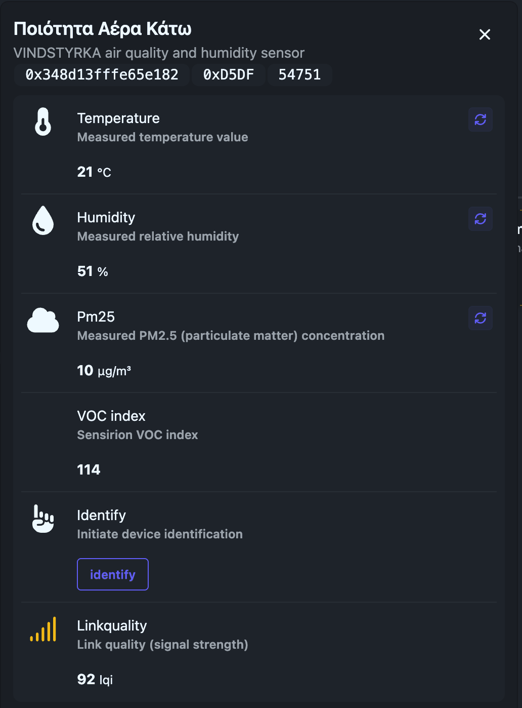
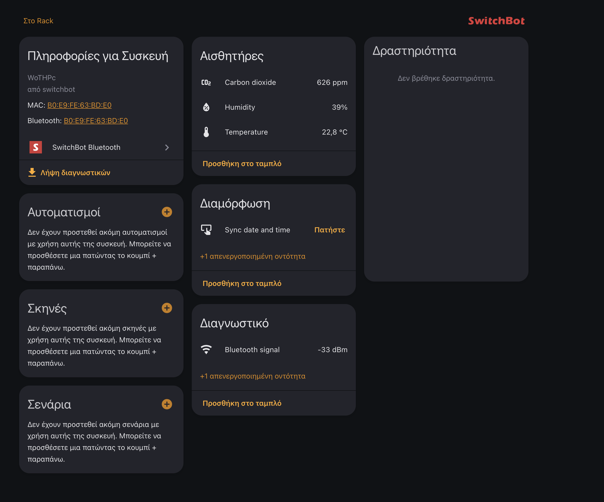
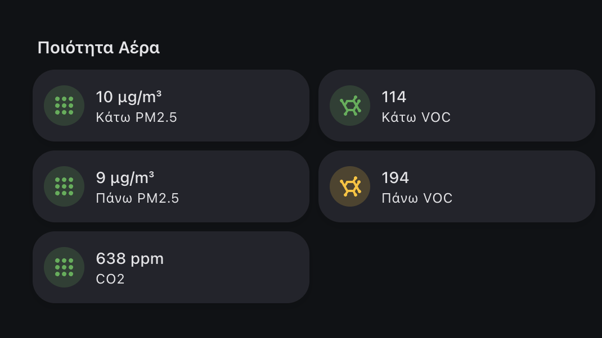

## The Problem with Raw Numbers

My house has air quality sensors on two floors plus a CO2 monitor. They report numbers like CO2: 847 ppm, PM2.5: 12 µg/m³, VOC index: 194. These are accurate and useful — if you know what they mean.

Nobody looks at a dashboard and thinks "oh, 1200 ppm CO2 with VOC at 310, I should ventilate for about 5 minutes." They want a simple answer: **is the air good or bad, and what should I do about it?**

So I built two things:
1. A **composite health score** (0-100) that weighs all sensors into one number
2. **Actionable tips** that appear on the dashboard telling you exactly what to do — "open a window for 5 minutes" instead of "CO2 is elevated"

## The Sensors

| Device | What it measures | Location |
|--------|-----------------|----------|
| **[IKEA VINDSTYRKA](https://www.ikea.com/us/en/p/vindstyrka-air-quality-sensor-smart-30498239/)** (×2) | PM2.5, VOC index, temperature, humidity | One per floor (via Zigbee) |
| **[SwitchBot Meter Pro CO2](https://www.switch-bot.com/products/switchbot-meter-pro-co2-monitor)** | CO2, temperature, humidity | Central location (via Bluetooth) |





The VINDSTYRKA is great for particulate matter and volatile organic compounds — it uses a Sensirion sensor that provides both PM2.5 (µg/m³) and a VOC index (1-500). Having two of them (upstairs and downstairs) catches floor-level differences — cooking smoke stays downstairs, cleaning chemicals drift upstairs.

The SwitchBot adds the missing piece: **CO2 monitoring**. CO2 is the single best indicator of ventilation quality, and the VINDSTYRKA doesn't measure it.

## The Health Score: One Number, Weighted

Instead of displaying 4 separate metrics, a template sensor combines them into a single 0-100 score:


The weighting reflects how much each metric matters for indoor health:

| Metric | Weight | Why |
|--------|--------|-----|
| **CO2** | 40% | Best indicator of ventilation. Directly affects alertness and comfort. |
| **PM2.5** | 30% | Particulate matter from cooking, dust, outdoor pollution. Long-term health impact. |
| **VOC** | 20% | Volatile organics from cleaning products, paint, furniture off-gassing. |
| **Humidity** | 10% | Affects comfort and mold risk. Less actionable in the short term. |

Each metric is scored independently on a tiered scale:

```yaml
# CO2 scoring (40% weight)
      # Excellent
      # Good
     # Fair
     # Poor
      # Bad

# PM2.5 scoring (30% weight)






# VOC scoring (20% weight)





# Humidity scoring (10% weight) — sweet spot is 40-55%





# Weighted composite
{{ (co2_s*0.40 + pm_s*0.30 + voc_s*0.20 + hum_s*0.10) | round(0) }}
```

For PM2.5 and VOC, the sensor takes the **worst reading** between the two floors — if the kitchen is smoky, the score reflects it even if the bedroom is fine.

The result maps to a human-readable label:

| Score | Label | Emoji |
|-------|-------|-------|
| 85-100 | Excellent | 😄 |
| 70-84 | Good | 🙂 |
| 55-69 | Fair | 😐 |
| 40-54 | Poor | 😟 |
| 0-39 | Very poor | 😷 |

## The Actionable Tips

The score tells you how good the air is. The tips tell you **what to do about it**. They appear as secondary text on the dashboard card, triggered by whichever metric is the worst offender:

```yaml

  Open a window for 8-10 minutes now 🪟

  Open a window for 5 minutes to bring CO₂ down 🪟

  Open a window for 2-3 minutes for fresh air 👍

  Ventilate 10 minutes — VOC is very high 🪟

  Ventilate 5 minutes and avoid sprays/chemicals 🧴

  PM2.5 high — ventilate and use an air purifier if available 😷

  Looks like some dust or cooking — ventilate 5 minutes 🍳

```

The tips are prioritized: CO2 first (most common and most actionable), then VOC, then PM2.5. If everything is fine, no tip is shown — the score speaks for itself.



## The Dashboard Card

The whole thing is displayed on a single Mushroom card that changes color based on the score — green gradient for excellent, amber for fair, red for poor. The icon color matches. When a tip is active, the card gets slightly taller to accommodate the advice text.

The raw sensor values are still available on separate cards for anyone who wants the detail. But the health score card is the one people actually look at.

## Why These Thresholds?

The CO2 thresholds are based on well-established research:

- **< 700 ppm** — outdoor-like quality, excellent ventilation
- **700-900 ppm** — good, typical well-ventilated room
- **900-1200 ppm** — fair, starting to feel stuffy, cognitive performance begins to decline
- **1200-1600 ppm** — poor, drowsiness and reduced concentration
- **> 1600 ppm** — bad, headaches possible, ventilate immediately

PM2.5 follows WHO guidelines (annual mean < 5 µg/m³, 24-hour mean < 15 µg/m³), adjusted upward for practical indoor use where cooking and cleaning create temporary spikes.

VOC index thresholds follow the Sensirion SGP40 interpretation guide — the VINDSTYRKA uses this exact sensor.

## The Takeaway

Raw sensor values are for engineers. A 0-100 score with an emoji is for everyone else. And a specific tip — "open a window for 5 minutes" — is what actually gets someone to act.

The template sensor is about 30 lines of Jinja2 with no helpers, no automations, and no external dependencies. The dashboard card adds the human layer on top. Together, they turn three sensors and a bunch of numbers into something anyone understands at a glance.

## Appendix: Full Template Sensor

<details>
<summary>Click to expand — Air Quality Health Index YAML</summary>

```yaml
template:
  - sensor:
      - name: "Air Quality Health Index"
        unique_id: air_quality_health_index
        unit_of_measurement: "%"
        icon: mdi:air-filter
        state_class: measurement
        availability: >
          {{ states('sensor.your_co2_sensor') not in ['unknown','unavailable','none',''] }}
        state: >
          
          
          
          
          
          
          
          

          {# CO2 scoring (40% weight) #}
          
          
          
          
          
          

          {# PM2.5 scoring (30% weight) #}
          
          
          
          
          

          {# VOC scoring (20% weight) #}
          
          
          
          

          {# Humidity scoring (10% weight) #}
          
          
          
          
          

          {{ (co2_s*0.40 + pm_s*0.30 + voc_s*0.20 + hum_s*0.10) | round(0) | int }}
```

</details>

## Appendix: Dashboard Card (Mushroom Template)

<details>
<summary>Click to expand — Mushroom card YAML with dynamic colors and tips</summary>

```yaml
type: custom:mushroom-legacy-template-card
entity: sensor.air_quality_health_index
primary: >
  
  
    Air Quality · —
  
    
    
      
    
      
    
      
    
      
    
      
    
    Air Quality · {{ mood }} {{ label }} · {{ score }}/100
  
secondary: >
  
  
  
  
  
  
  
  

  
    
  
    
  
    
  
    
  
    
  
    
  
    
  
  {{ msg }}
multiline_secondary: true
icon: mdi:air-filter
icon_color: >
  
  
    disabled
  
    
    green
    light-green
    amber
    orange
    red
  
layout: horizontal
fill_container: true
tap_action:
  action: more-info
  entity: sensor.air_quality_health_index
card_mod:
  style: >
    
    

    
      
      
    
      
      
    
      
      
    
      
      
    
      
      
    

    ha-card {
      padding: 14px 16px 12px;
      border-radius: 18px;
      background: {{ bg }};
      --mush-icon-size: 34px;
      --mush-card-primary-font-size: 1.20rem;
      --mush-card-secondary-font-size: .90rem;
      position: relative;
      overflow: hidden;
    }
    ha-card::after {
      content: '';
      position: absolute;
      inset: -2px;
      border-radius: 20px;
      box-shadow: {{ ring }};
      pointer-events: none;
    }
```

</details>
