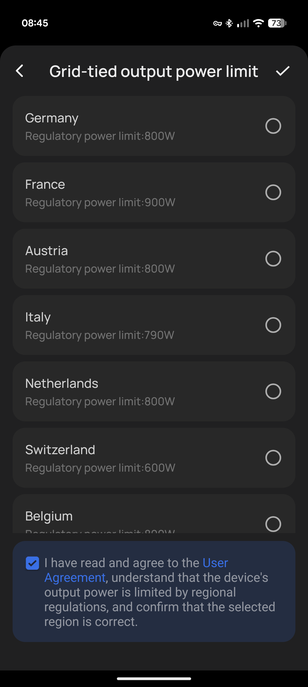
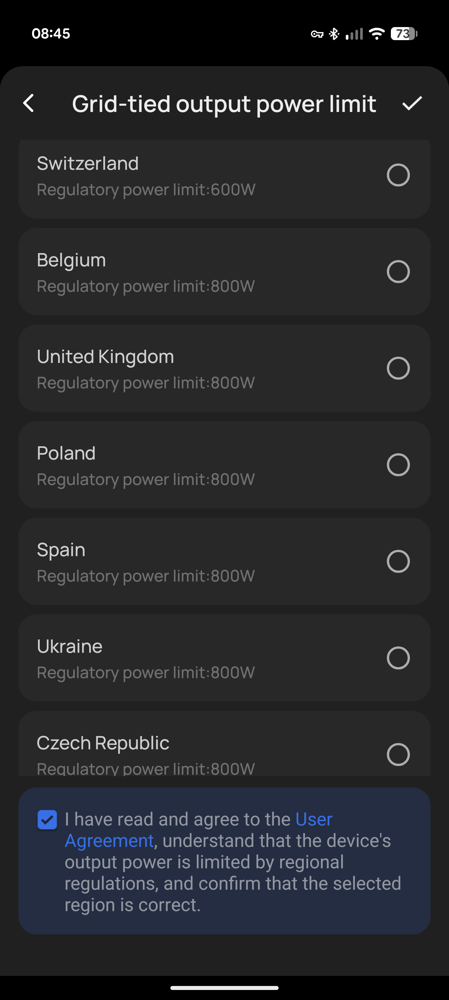
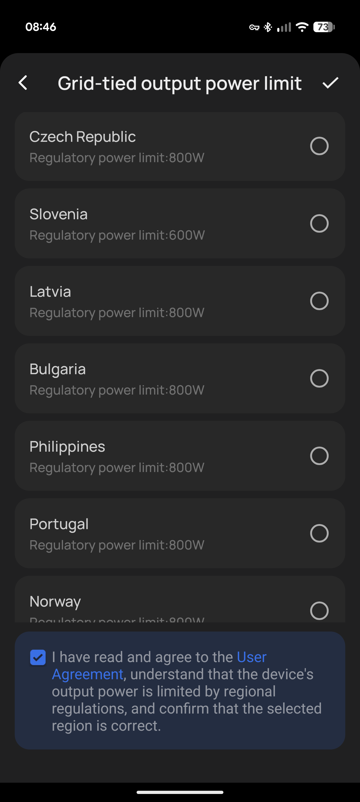

> **Update — April 2026:** After more than a year of "examining", Greece is finally legislating balcony solar. On 21 April 2026, YPEN submitted a new RES bill to Parliament that explicitly opens the door for plug-in solar systems. A ministerial decision — expected in May — will set the framework: up to 800W, notification-only registration at DEDDIE via a new digital platform. [Read the full update below.](#april-2026-update--greece-is-finally-moving)

## The Idea is Simple

Take a solar panel or two, mount them on your balcony, plug a micro-inverter into a wall socket, and start producing your own electricity. No electrician, no permits, no roof access needed. In many EU countries, this is not only legal — it's encouraged and subsidized.

The concept is called **balcony solar** (or plug-in solar, [Balkonkraftwerk](https://de.wikipedia.org/wiki/Balkonkraftwerk) in German). It's designed for renters, apartment dwellers, and anyone who can't install a full rooftop system. The typical setup is 1-2 panels (600-800W) with a micro-inverter that feeds directly into your home circuit.

It's one of the fastest-growing segments in European solar. And Greece — one of the sunniest countries in Europe — is somehow still figuring out if it's allowed.

## What the EU Says

The European Union has been actively pushing solar adoption on buildings. The revised [Energy Performance of Buildings Directive (EPBD)](https://energy.ec.europa.eu/topics/energy-efficiency/energy-performance-buildings/energy-performance-buildings-directive/solar-energy-buildings_en) requires solar installations on new buildings, entering into force gradually from 2026. The directive explicitly covers facades, **balconies**, terraces, and similar structures — not just rooftops.

Multiple EU member states have already implemented clear frameworks:

| Country | Status | Details |
|---------|--------|---------|
| **Germany** | Fully legal | Over **1 million** registered systems. Up to 2kW / 800VA. Online registration only. |
| **Austria** | Legal | Up to 800W, simplified registration |
| **Netherlands** | Legal | Up to 600W, plug-and-play allowed |
| **Belgium** | Legal (2025) | Synergrid safety certification required |
| **Italy** | Legal | Various regional incentives |
| **Bulgaria** | Fully legal | Legislated and approved |

The trend is clear: the EU wants citizens to generate their own electricity with minimal bureaucracy. Germany alone added 435,000 balcony PV systems in 2024.

Here's the EcoFlow app's grid-tied output configuration — it lists every country where balcony solar is officially regulated, with the regulatory power limit. Notice anything missing?


  
  
  


Germany, France, Austria, Italy, Netherlands, Switzerland, Belgium, UK, Poland, Spain, Ukraine, Czech Republic, Slovenia, Latvia, Bulgaria, Portugal, Norway — and no Greece.

## What Greece Says

~~Nothing. Literally nothing.~~ *That was the situation when this article was first published in March 2026. Things have changed — [skip to the April update](#april-2026-update--greece-is-finally-moving) if you want the latest.*

As of March 2026, Greece had **no specific legislation** for balcony solar panels. There was no law that explicitly allowed them, and no law that explicitly banned them. It was a regulatory void.

**What had been promised:**
- The Ministry of Environment and Energy was ["examining" the introduction of balcony solar](https://energypress.gr/news/erhontai-kai-stin-ellada-ta-fotoboltaika-mpalkonioy-exetazetai-nomothetiki-rythmisi-paketo-me) as part of a package with net-billing modifications
- The [Association of Photovoltaic Companies (SEF)](https://energypress.gr/news/fotoboltaika-mpalkonioy-aplos-balto-stin-priza) had presented a proposal to the ministry, which responded "positively in principle"
- A plan existed to create a registry at [DEDDIE](https://deddie.gr/) (the grid operator) — registration only, no licensing
- A 3-month adjustment period was planned for DEDDIE to build the platform

**What had actually happened (as of March 2026):**
- None of this had been implemented
- "Examining" had been the status for over a year
- The existing self-consumption framework had no category for plug-in systems
- Greek stores were already selling balcony solar kits — [BestPrice.gr lists EcoFlow panels](https://www.bestprice.gr/cat/8886/fotovoltaika-panel/f/1_43271/ecoflow.html), [SolarFox.gr](https://www.solarfox.gr/index.php?cPath=1) sells dedicated balcony kits, [fotovoltaika.gr](https://www.fotovoltaika.gr/) offers plug-and-play systems, [eshop.com.gr](https://www.eshop.com.gr/%CF%86%CF%89%CF%84%CE%BF%CE%B2%CE%BF%CE%BB%CF%84%CE%B1%CF%8A%CE%BA%CE%AC-%CE%BC%CF%80%CE%B1%CE%BB%CE%BA%CE%BF%CE%BD%CE%B9%CE%BF%CF%8D-%CF%80%CF%81%CE%AF%CE%B6%CE%B1%CF%82/) has a full balcony solar category, and [Electric Power](https://el-power.gr/product/%CF%86%CF%89%CF%84%CE%BF%CE%B2%CE%BF%CE%BB%CF%84%CE%B1%CF%8A%CE%BA%CE%BF-%CE%BA%CE%B9%CF%84-%CE%BC%CF%80%CE%B1%CE%BB%CE%BA%CE%BF%CE%BD%CE%B9%CE%BF%CF%85/) sells 1000W balcony kits. The market existed. The law didn't.

One of the sunniest countries in Europe, and we were behind Belgium.

## April 2026 Update — Greece is Finally Moving

It took over a year of "examining", but it's actually happening.

On **21 April 2026**, the Ministry of Environment and Energy ([YPEN](https://ypen.gov.gr/)) submitted a new **RES (Renewable Energy Sources) bill** to the [Hellenic Parliament](https://www.hellenicparliament.gr/), titled *"Modernization of legislation regarding renewable energy use and production"*. The bill is currently under committee review and has not yet been voted into law — but it explicitly includes provisions that open the door for balcony solar in Greece for the first time.

Separately, a **ministerial decision** amending the existing net-billing framework ([MD YPEN/DAPEEK/93976/2772](https://www.e-nomothesia.gr/), Government Gazette 5074B'/5.9.2024) is in its final stages and [expected to be published in **May 2026**](https://energypress.gr/news/anoigei-paihnidi-gia-ta-fotoboltaika-mpalkonioy-eidiki-problepsi-stin-apofasi-toy-ypen-gia-net). This is the instrument that will actually operationalize balcony solar.

### What the framework will look like

Based on reporting from [EnergyPress](https://energypress.gr/news/anoigei-paihnidi-gia-ta-fotoboltaika-mpalkonioy-eidiki-problepsi-stin-apofasi-toy-ypen-gia-net):

| Parameter | Details |
|-----------|---------|
| **Maximum capacity** | 800 watts |
| **Typical configuration** | 2 panels + micro-inverter + mounting system |
| **Connection method** | Direct plug-in via standard Schuko outlet |
| **Procedure** | Notification only — no permit, no electrician, no licensing |
| **Registration** | Via a new DEDDIE digital platform (to be built) |
| **Safety requirements** | Anti-islanding mandatory — inverter must cease injection during grid outages |
| **Estimated cost** | €700–1,000 per installation |
| **Expected savings** | 20–30% annual reduction on electricity bills |

The registration will require owners to declare:
- Equipment model and manufacturer
- Wattage rating
- Component types (panels, inverter, mounting)

This is essentially the same model Germany, Austria, and the Netherlands have been running for years — a digital notification form, not a permit process.

### DEDDIE is already processing self-generation at scale

As of April 2026, [DEDDIE has received **5,730 applications** for self-generation systems](https://energypress.gr/news/net-billing-pro-ton-pylon-i-tropopoiitiki-ypoyrgiki-apofasi-5730-aitiseis-ston-deddie-gia) under the existing net-billing and virtual net-billing frameworks, totaling **328 MW** of capacity. Of these, **845 systems (19 MW)** are already operational. So the grid operator isn't starting from zero — the infrastructure for tracking distributed generation is already in place. What's new is adding a lightweight, notification-only path for small plug-in systems.

### A historical footnote

Greece actually tested the balcony solar concept **25 years ago** — when Greenpeace installed the country's first balcony photovoltaic system on a former government building in Athens. It was a statement piece at the time. Now, a quarter-century later, the legislation is finally catching up with the technology.

### What's still uncertain

The bill is in parliamentary committee — **it has not yet been voted into law**. The ministerial decision is expected in May but hasn't been published. Until both happen, the grey zone technically persists. But the direction is now unmistakable: Greece is legalizing balcony solar, and the framework will closely mirror what the rest of Europe already has.

## My Setup — And What the Meter Actually Records

I have an [EcoFlow Stream Ultra](https://eu.ecoflow.com/products/stream-ultra-pro) with 4 bifacial panels on my balcony, running in **zero-export mode**. The system never intentionally feeds electricity back to the grid — everything goes to batteries first, then to the house.

But "zero-export" isn't mathematically perfect. Here's why: the EcoFlow constantly monitors house consumption via a [Shelly Pro 3EM](https://www.shelly.com/products/shelly-pro-3-em) energy meter and adjusts its output to match. But when a high-draw appliance suddenly stops — say a kettle that was pulling 1000W finishes boiling — there's a brief gap. The kettle stops drawing instantly, but EcoFlow is still injecting those 1000W into the house. It takes a moment for the Shelly to read the new (lower) consumption, report it back to EcoFlow, and for EcoFlow to throttle down its output. During that brief window, some power leaks to the grid. The DEDDIE smart meter records everything.

Here's what the meter's **export register (2.8.0)** has recorded since installation:

| Date | Total Export (kWh) |
|------|-------------------|
| 24/09/2025 | 0.00 |
| 25/09/2025 | 0.07 |
| 30/09/2025 | 0.60 |
| 01/10/2025 | 0.72 |
| 02/10/2025 | 0.73 |
| 07/10/2025 | 0.92 |
| 11/10/2025 | 1.33 |
| 20/10/2025 | 1.75 |
| 07/11/2025 | 2.54 |
| 04/12/2025 | 3.34 |
| 11/01/2026 | 4.10 |
| 08/02/2026 | 4.86 |


type: 'line',
data: {
  labels: ['24/09', '25/09', '30/09', '01/10', '02/10', '07/10', '11/10', '20/10', '07/11', '04/12', '11/01', '08/02'],
  datasets: [{
    label: 'Total Export (kWh)',
    data: [0, 0.07, 0.60, 0.72, 0.73, 0.92, 1.33, 1.75, 2.54, 3.34, 4.10, 4.86],
    borderColor: 'rgba(239,68,68,0.8)',
    backgroundColor: 'rgba(239,68,68,0.1)',
    fill: true,
    tension: 0.3
  }]
},
options: {
  plugins: {
    title: {
      display: true,
      text: 'Grid Export Leakage Over Time (register 2.8.0)'
    }
  },
  scales: {
    y: {
      title: {
        display: true,
        text: 'kWh'
      }
    }
  }
}


**4.86 kWh exported in ~5 months** — that's about 1 kWh per month of leakage. For context, that's roughly the energy to run a light bulb for 10 hours. It's practically nothing, but the meter catches every fraction of it.

The meter is a Sanxing SX5A2-SELS-04 — a modern smart meter that records:
- **1.8.0** — Total import (what you consume from the grid)
- **1.8.1 / 1.8.2** — Import by tariff
- **2.8.0** — Total export (what goes back to the grid)

The meter records these exports in register 2.8.0 whether anyone looks or not. If DEDDIE reads the meter remotely (which smart meters support), they could see those 4.86 kWh. Whether anyone actually checks or cares about 1 kWh/month of export from what's clearly a small domestic system — that's another question entirely.

## The Practical Reality

From a technical standpoint:
- **DEDDIE sees almost nothing** — 1 kWh/month of export is noise-level
- **No impact on the grid** — the system is electrically invisible for all practical purposes
- **No net-metering agreement needed** — I'm not selling or feeding back anything meaningful
- **I'm consuming my own production** — batteries absorb the surplus, the house uses it, and when there's enough sun the [EV charges from the excess](/posts/pv-surplus-ev-charging/)
- **Safe during power outages** — all grid-tied inverters (including EcoFlow) are required to have **anti-islanding protection**. When the grid goes down, the inverter stops injecting immediately. It rides the grid's carrier signal — no grid signal, no injection. This is a hard safety requirement across the EU: electricians and utility workers repairing a power outage will never be exposed to energy being fed back from a balcony solar system. The inverter physically cannot operate without detecting a live grid.

The "risk" is not a fine or disconnection — nobody is policing balcony solar in Greece. The risk is that there's no legal clarity, which means:
- You can't get insurance coverage that explicitly mentions your solar system
- If there's ever an electrical incident, you have no legal framework to point to
- Your electrician might refuse to sign off on the installation

## What Still Needs to Happen

~~What Greece needs is what every other EU country has already done.~~ Greece is now doing it. But it's not done yet. Here's what remains:

1. **Pass the RES bill** — currently in parliamentary committee, needs a floor vote
2. **Publish the ministerial decision** — expected May 2026, this is the actual operational framework
3. **DEDDIE must build the digital platform** — the registration portal where citizens notify their installations
4. **Clarify zero-export systems** — the current framework focuses on grid-tied systems. Zero-export setups like mine, which don't meaningfully feed the grid, should ideally be exempt from registration entirely
5. **Insurance and liability clarity** — even after legalization, homeowners need clear guidance on how balcony solar interacts with building insurance

Germany did this years ago. Austria did this. The Netherlands did this. Belgium did this last year. Bulgaria has fully legislated and approved it. Greece is catching up — late, but moving.

## The Bottom Line

If you're in Greece and wondering about balcony solar: the hardware works, the savings are real, the technology is mature, and the EU is pushing it. My system has been running for 7 months with less than 5 kWh of accidental export.

And now, for the first time, the Greek government is actively legislating it. A new RES bill is in parliament. A ministerial decision is expected in May. The 800W threshold and DEDDIE registration path mirror exactly what other EU countries have already implemented.

The grey zone is closing. Whether you wait for the ministerial decision to be published, or install now knowing the legal framework is weeks away — that's your call. But the risk calculus has fundamentally changed. This isn't "maybe someday" anymore. It's happening.

---

*Sources:*
- *[EU Solar Energy in Buildings Directive](https://energy.ec.europa.eu/topics/energy-efficiency/energy-performance-buildings/energy-performance-buildings-directive/solar-energy-buildings_en)*
- *[EnergyPress — Balcony solar arrives in Greece (2025)](https://energypress.gr/news/erhontai-kai-stin-ellada-ta-fotoboltaika-mpalkonioy-exetazetai-nomothetiki-rythmisi-paketo-me)*
- *[EnergyPress — Balcony solar in the YPEN net-billing decision (April 2026)](https://energypress.gr/news/anoigei-paihnidi-gia-ta-fotoboltaika-mpalkonioy-eidiki-problepsi-stin-apofasi-toy-ypen-gia-net)*
- *[EnergyPress — Net-billing ministerial decision imminent, 5,730 applications at DEDDIE (April 2026)](https://energypress.gr/news/net-billing-pro-ton-pylon-i-tropopoiitiki-ypoyrgiki-apofasi-5730-aitiseis-ston-deddie-gia)*
- *[2025 European Balcony Solar Policies](https://bslbatt.com/blogs/2025-european-balcony-solar-policies-subsidies/)*
- *[The Rise of Plug-In Solar in Europe](https://strategicenergy.eu/plug-in-solar-europe/)*
- *[Greece Energy Laws 2026](https://www.globallegalinsights.com/practice-areas/energy-laws-and-regulations/greece/)*
