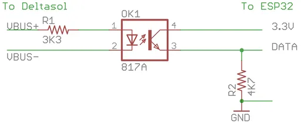
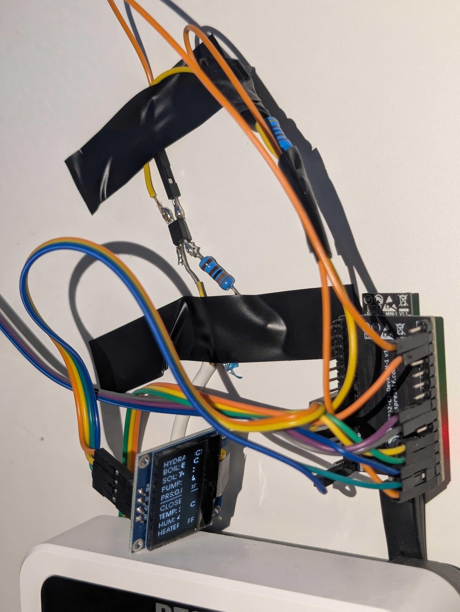
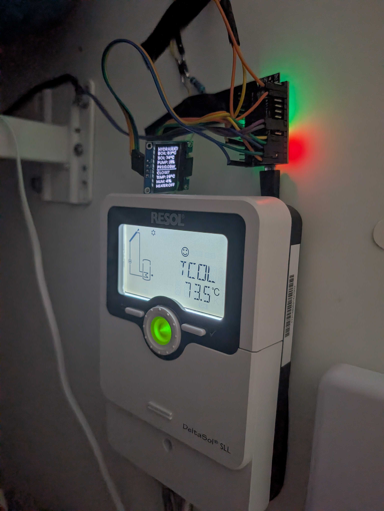
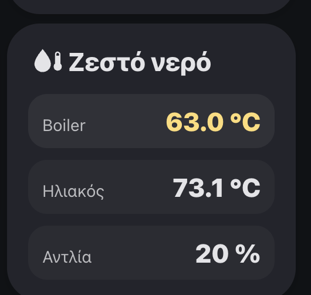
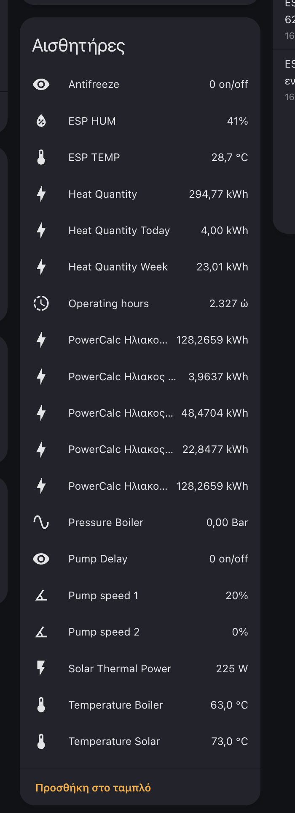

## Why Bother?

My boiler room has a solar thermal system with a Resol DeltaSol controller running the circulation pump. It does its job — but it's a black box. I can't see temperatures, pump status, or energy production from anywhere except a tiny LCD on the wall.

The electric backup heater is worse — a mechanical thermostat with no scheduling, no target temperature, and no safety beyond a basic overheat cutoff.

I wanted full visibility into the solar thermal system **and** smart control of the electric heater. An ESP32 handles the monitoring — reading the Resol, measuring pressure and climate, driving the local display. Home Assistant handles the control — scheduling the heater, enforcing safety, sending notifications.

## The Hardware

| Component | Role |
|-----------|------|
| **ESP32 DevKit** | Runs ESPHome, talks to everything |
| **[Resol DeltaSol SLL](https://www.resol.de/)** | Solar thermal differential thermostat |
| **VBus optocoupler** | Reads Resol's [VBus protocol](https://esphome.io/components/vbus/) via UART |
| **DHT22** | Boiler closet temperature + humidity |
| **Pressure transducer** (0-100 PSI) | Hydraulic system pressure |
| **[SSD1306 OLED](https://www.aliexpress.com/item/1005006385950490.html)** (128x64) | Local status display |
| **[Shelly Pro 4PM](https://us.shelly.com/products/shelly-pro-4pm)** | Switches the heater via a power contactor (see below) |

### Heater Switching: Shelly + Power Contactor

The Shelly Pro 4PM handles up to 16A per channel, but the boiler's heating element draws close to that limit. Running a smart relay at its rated maximum continuously is asking for trouble. Instead, the Shelly drives a **[Hager ESC225 power contactor](https://hager.com/ie/catalogue/products/esc225-contactor-25a-2no-230v)** (25A, 2NO) — the Shelly switches the contactor coil (a few watts), and the contactor handles the actual heater current safely.


## Reading the Resol DeltaSol via VBus

The Resol uses a proprietary single-wire protocol called [VBus](https://esphome.io/components/vbus/). An optocoupler circuit (817A with a 3K3 input resistor and 4K7 pull-down) isolates the bus and feeds data to the ESP32's UART.

 ESPHome has native VBus support. If you need to find the byte offsets and source addresses for your specific Resol controller, the [VBus protocol specification and field database](https://danielwippermann.github.io/resol-vbus/#/vsf) has everything documented.

```yaml
uart:
  id: resol
  rx_pin: 4
  baud_rate: 9600

vbus:
  uart_id: resol
```

The DeltaSol sends two frame types. The main frame (source `0x2271`) carries solar collector temperature, boiler temperature, pump speed, operating hours, and error codes. The heat meter frame (source `0x2272`) carries instantaneous thermal power and cumulative energy — perfect for Home Assistant's Energy Dashboard.

The solar collector temperature needs signed decoding since it can go negative on winter nights:

```yaml
lambda: |-
  unsigned lsb = x[4];
  unsigned msb = x[5];
  float temp = 0;
  if (msb > 127) {
    temp = (65536 - msb * 256 - lsb) * -0.1f;
  } else {
    temp = (msb * 256 + lsb) * 0.1f;
  }
  if (temp < -20 || temp > 200) return NAN;
  return temp;
```





## The OLED + Status LED

The SSD1306 runs in portrait mode and shows two sections: **HYDRAULICS** (boiler temp, solar temp, pump speed, pressure) and **CLOSET** (ambient temp, humidity, heater state). Values blink when abnormal. A NeoPixel LED mirrors the status — green when everything is normal, red when anything needs attention. Glanceable from across the room.

## The Automation: Smart Heater Control

With all sensor data in Home Assistant, the electric backup heater gets a proper controller:


flowchart TD
    A["Every 5 min\n18:00-22:00"] --> B{Sensors OK?}
    C["Temp > 58°C"] --> D["SAFETY OFF"]
    E["On > 1.5 hours"] --> D

    B -->|No| F["Log + notify, stop"]
    B -->|Yes| G{Temp < 40°C\nAND heater off?}
    G -->|No| H["Skip"]
    G -->|Yes| I["Turn ON"]
    I --> J["Wait for 50°C\nor 60 min timeout"]
    J --> K["Turn OFF + notify"]

    style D fill:#991b1b,stroke:#ef4444,color:#fff
    style I fill:#166534,stroke:#22c55e,color:#fff
    style F fill:#854d0e,stroke:#eab308,color:#fff


**Evening schedule:** Every 5 minutes between 18:00–22:00, if the boiler is below 40°C and the heater is off, turn it on and wait until 50°C (or 60 min timeout). If solar thermal already heated the water, it does nothing.

**Safety (24/7):** Over-temperature (>58°C) or stuck-on (>1.5 hours) — immediate shutoff + Telegram notification.

**Sensor validation:** If the temperature sensor or heater switch is unavailable, the automation refuses to act and notifies you. A smart boiler that can't read its own temperature is more dangerous than a dumb one.

The key pattern is `wait_template` with a timeout — heat until done, never longer than the safety limit:

```yaml
- wait_template: "{{ states(boiler_sensor) | float(0) >= target_c }}"
  timeout: "01:00:00"
  continue_on_timeout: true
```

After the wait, `wait.completed` tells you whether you hit the target or timed out.

## The Result





With everything wired up on a single ESP32, Home Assistant sees: solar collector temp, boiler temp, pump speed, thermal power (W), cumulative heat energy (kWh) for the Energy Dashboard, operating hours, error codes, hydraulic pressure, closet climate, and full heater audit trail via Telegram.

We never waste electricity on heating the boiler — we only heat it when there wasn't enough sun during the day to do the job, and only to the exact temperature we need. We never touch the boiler manually anymore. It's one less thing to think about — the system guarantees hot water is ready every evening without anyone having to remember to flip a switch.

The cost savings are real too. Before this, the boiler's 5kW heating element would run for hours because nobody remembered to turn it off, or the mechanical thermostat would overshoot well past what we needed. Now we have a closed-loop system that heats to exactly 50°C and stops — no more paying for electricity to keep water at 70°C when 50°C is perfectly fine.

And beyond the heater control, we're closely monitoring both the boiler and solar collector temperatures around the clock. If the solar panels overheat, if the boiler gets stuck at a weird temperature, or if hydraulic pressure drops — we know immediately, not when someone complains about cold water.

## Appendix: Full ESPHome Configuration

<details>
<summary>Click to expand — ESPHome YAML</summary>

```yaml
substitutions:
  name: esphome-boiler
  friendly_name: ESP32_Boiler

esphome:
  name: ${name}
  friendly_name: ${friendly_name}

esp32:
  board: esp32-c3-devkitm-1
  framework:
    type: arduino

logger:
api:
ota:
  - platform: esphome

wifi:
  ap: {}

captive_portal:

web_server:
  version: 3

# --- VBus connection to Resol DeltaSol ---
uart:
  id: resol
  rx_pin: 4
  baud_rate: 9600

vbus:
  uart_id: resol

sensor:
  # --- Closet climate ---
  - platform: dht
    pin: 10
    model: DHT22
    temperature:
      id: closet_temp
      name: "Closet Temperature"
    humidity:
      id: closet_hum
      name: "Closet Humidity"
    update_interval: 30s

  # --- Hydraulic pressure (0-100 PSI transducer) ---
  - platform: adc
    id: pressure_hydralics
    pin: 0
    name: "Hydraulic Pressure"
    unit_of_measurement: "Bar"
    samples: 5
    attenuation: 12db
    filters:
      - calibrate_linear:
          datapoints:
            - 0.49175675 -> 0
            - 4.54175676 -> 100
      - lambda: |-
          float bar = x * 0.0689476;
          return (bar < 0) ? 0 : bar;

  # --- Resol DeltaSol main data ---
  - platform: vbus
    model: custom
    dest: 0x10
    source: 0x2271
    command: 0x100
    sensors:
      - id: temperature_solar
        name: "Solar Collector Temperature"
        device_class: temperature
        unit_of_measurement: "°C"
        lambda: |-
          unsigned lsb = x[4]; unsigned msb = x[5];
          float temp = (msb > 127)
            ? (65536 - msb * 256 - lsb) * -0.1f
            : (msb * 256 + lsb) * 0.1f;
          return (temp < -20 || temp > 200) ? NAN : temp;
        filters:
          - sliding_window_moving_average:
              window_size: 30
              send_every: 30

      - id: temperature_boiler
        name: "Boiler Temperature"
        device_class: temperature
        unit_of_measurement: "°C"
        lambda: |-
          float temp = ((x[7] << 8) + x[6]) * 0.1f;
          return (temp < 0 || temp > 120) ? NAN : temp;
        filters:
          - sliding_window_moving_average:
              window_size: 30
              send_every: 30

      - id: pump_speed_1
        name: "Pump Speed"
        unit_of_measurement: "%"
        lambda: return x[20];

      - id: operating_hours
        name: "Operating Hours"
        device_class: duration
        unit_of_measurement: "h"
        lambda: return ((x[35]<<24)+(x[34]<<16)+(x[33]<<8)+x[32]);

      - id: error_mask
        name: "Error Mask"
        entity_category: diagnostic
        lambda: return ((x[75]<<24)+(x[74]<<16)+(x[73]<<8)+x[72]);

  # --- DeltaSol SLL heat meter ---
  - platform: vbus
    model: custom
    dest: 0x10
    source: 0x2272
    command: 0x100
    sensors:
      - id: sll_power_w
        name: "Solar Thermal Power"
        unit_of_measurement: "W"
        device_class: power
        lambda: |-
          if (x.size() < 8) return NAN;
          return (float)((uint32_t)x[4]|((uint32_t)x[5]<<8)
                       |((uint32_t)x[6]<<16)|((uint32_t)x[7]<<24));

      - id: sll_heat_kwh
        name: "Heat Quantity Total"
        unit_of_measurement: "kWh"
        device_class: energy
        state_class: total_increasing
        lambda: |-
          if (x.size() < 4) return NAN;
          uint32_t wh = (uint32_t)x[0]|((uint32_t)x[1]<<8)
                      |((uint32_t)x[2]<<16)|((uint32_t)x[3]<<24);
          return wh / 1000.0f;

      - id: sll_heat_today_kwh
        name: "Heat Quantity Today"
        unit_of_measurement: "kWh"
        device_class: energy
        state_class: total
        lambda: |-
          if (x.size() < 12) return NAN;
          uint32_t wh = (uint32_t)x[8]|((uint32_t)x[9]<<8)
                      |((uint32_t)x[10]<<16)|((uint32_t)x[11]<<24);
          return wh / 1000.0f;

# --- OLED Display (portrait) ---
i2c:
  sda: 6
  scl: 7
  frequency: 350kHz

font:
  - file: "gfonts://Poppins"
    id: my_font
    size: 11

display:
  - platform: ssd1306_i2c
    model: "SSD1306 128x64"
    address: 0x3C
    update_interval: 1s
    rotation: 90
    lambda: |-
      it.printf(0, 8, id(my_font), TextAlign::BASELINE_LEFT, "HYDRAULICS");
      it.printf(0, 20, id(my_font), TextAlign::BASELINE_LEFT,
                "BOIL: %.0f C", id(temperature_boiler).state);
      it.printf(0, 34, id(my_font), TextAlign::BASELINE_LEFT,
                "SOL: %.0f C", id(temperature_solar).state);
      it.printf(0, 48, id(my_font), TextAlign::BASELINE_LEFT,
                "PUMP: %.0f%%", id(pump_speed_1).state);
      it.printf(0, 62, id(my_font), TextAlign::BASELINE_LEFT,
                "PRS:%.1fBar", id(pressure_hydralics).state);
      for (int x = 0; x < 128; x++) it.draw_pixel_at(x, 66);
      it.printf(0, 80, id(my_font), TextAlign::BASELINE_LEFT, "CLOSET");
      it.printf(0, 94, id(my_font), TextAlign::BASELINE_LEFT,
                "TEMP: %.0f C", id(closet_temp).state);
      it.printf(0, 108, id(my_font), TextAlign::BASELINE_LEFT,
                "HUM: %.0f%%", id(closet_hum).state);
      it.printf(0, 122, id(my_font), TextAlign::BASELINE_LEFT,
                "HEATER:%s", id(switch_shelly_rack_switch_2).state ? "ON" : "OFF");

# --- Status LED ---
light:
  - platform: neopixelbus
    variant: WS2811
    pin: 8
    num_leds: 1
    name: "Status LED"
    id: esp32_rgb_led

# --- Heater switch (from HA) ---
switch:
  - platform: homeassistant
    name: "Heater Switch"
    entity_id: switch.your_boiler_relay
    id: switch_shelly_rack_switch_2
```

</details>

<details>
<summary>Click to expand — HA Automation: Smart Boiler Controller</summary>

```yaml
alias: "Smart Boiler Controller — Evening + Safety"
description: >-
  18:00-22:00: every 5 min, if boiler < 40°C and heater off, turn ON
  until 50°C or max 60 min. Safety: over-temp >58°C and stuck-on >1.5h.

triggers:
  - trigger: time_pattern
    minutes: /5
    id: evening_check
  - trigger: numeric_state
    entity_id: sensor.your_boiler_temperature
    above: 58
    id: temp_too_high
  - trigger: state
    entity_id: switch.your_boiler_relay
    to: "on"
    for: "01:30:00"
    id: on_too_long

conditions: []

actions:
  # --- Validate inputs ---
  - choose:
      - conditions:
          - condition: template
            value_template: "{{ states(heater_switch) in ['unknown','unavailable'] }}"
        sequence:
          - action: notify.send_message
            target:
              entity_id: "{{ notify_entity }}"
            data:
              title: "Boiler"
              message: "Cannot control boiler: switch is {{ states(heater_switch) }}."
          - stop: "Heater switch unavailable"
      - conditions:
          - condition: template
            value_template: "{{ temp_now is none }}"
        sequence:
          - action: notify.send_message
            target:
              entity_id: "{{ notify_entity }}"
            data:
              title: "Boiler"
              message: "Cannot read boiler temperature: {{ states(boiler_sensor) }}."
          - stop: "Sensor unavailable"

  # --- Safety (24/7) ---
  - choose:
      - conditions:
          - condition: template
            value_template: "{{ trigger.id in ['temp_too_high','on_too_long'] }}"
          - condition: template
            value_template: "{{ is_state(heater_switch, 'on') }}"
        sequence:
          - action: switch.turn_off
            target:
              entity_id: "{{ heater_switch }}"
          - action: notify.send_message
            target:
              entity_id: "{{ notify_entity }}"
            data:
              title: "Boiler"
              message: >-
                Safety OFF ({{ trigger.id }}).
                Temp: {{ (states(boiler_sensor)|float(0)) | round(1) }}°C.
          - stop: "Safety handled"

  # --- Evening heating ---
  - choose:
      - conditions:
          - condition: template
            value_template: "{{ trigger.id == 'evening_check' }}"
          - condition: time
            after: "18:00:00"
            before: "22:00:00"
          - condition: template
            value_template: "{{ temp_now < min_temp_for_on }}"
          - condition: template
            value_template: "{{ is_state(heater_switch, 'off') }}"
        sequence:
          - action: switch.turn_on
            target:
              entity_id: "{{ heater_switch }}"
          - action: notify.send_message
            target:
              entity_id: "{{ notify_entity }}"
            data:
              title: "Boiler"
              message: "ON — target {{ target_c }}°C (now: {{ temp_now|round(1) }}°C)."
          - wait_template: "{{ states(boiler_sensor) | float(0) >= target_c }}"
            timeout: "{{ max_on }}"
            continue_on_timeout: true
          - variables:
              temp_after: "{{ states(boiler_sensor) | float(0) }}"
              reached: "{{ wait.completed }}"
          - action: switch.turn_off
            target:
              entity_id: "{{ heater_switch }}"
          - action: notify.send_message
            target:
              entity_id: "{{ notify_entity }}"
            data:
              title: "Boiler"
              message: >-
                OFF — {{ temp_after|round(1) }}°C
                (target {{ target_c }}°C, reached={{ reached }}).

variables:
  boiler_sensor: sensor.your_boiler_temperature
  heater_switch: switch.your_boiler_relay
  notify_entity: notify.your_telegram_bot
  min_temp_for_on: 40
  target_c: 50
  max_on: "01:00:00"
  temp_now: "{{ states(boiler_sensor) | float(none) }}"

mode: restart
max_exceeded: silent
```

</details>
