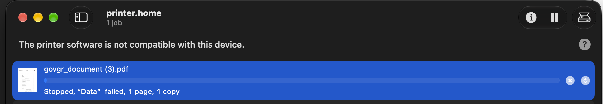
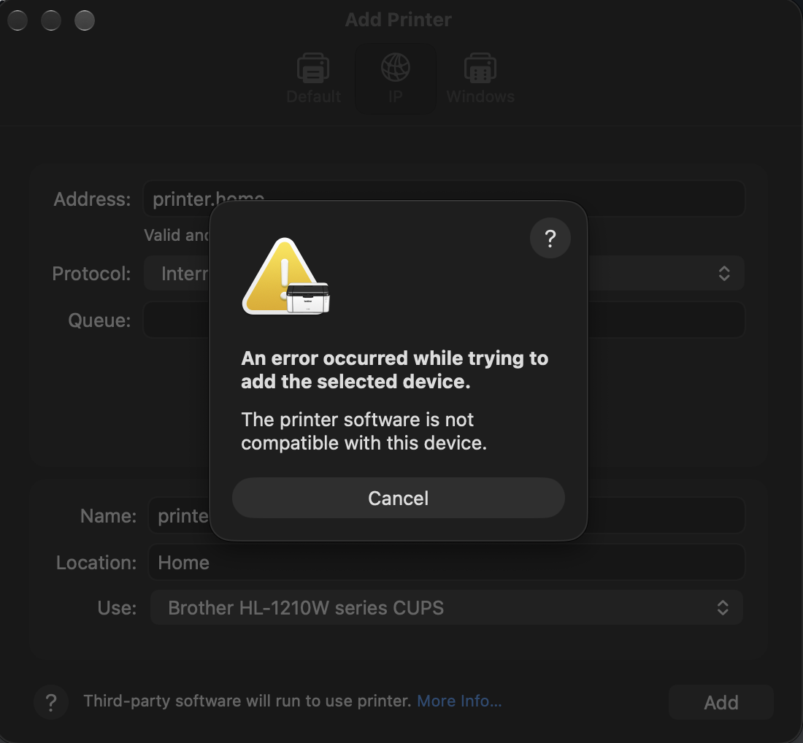
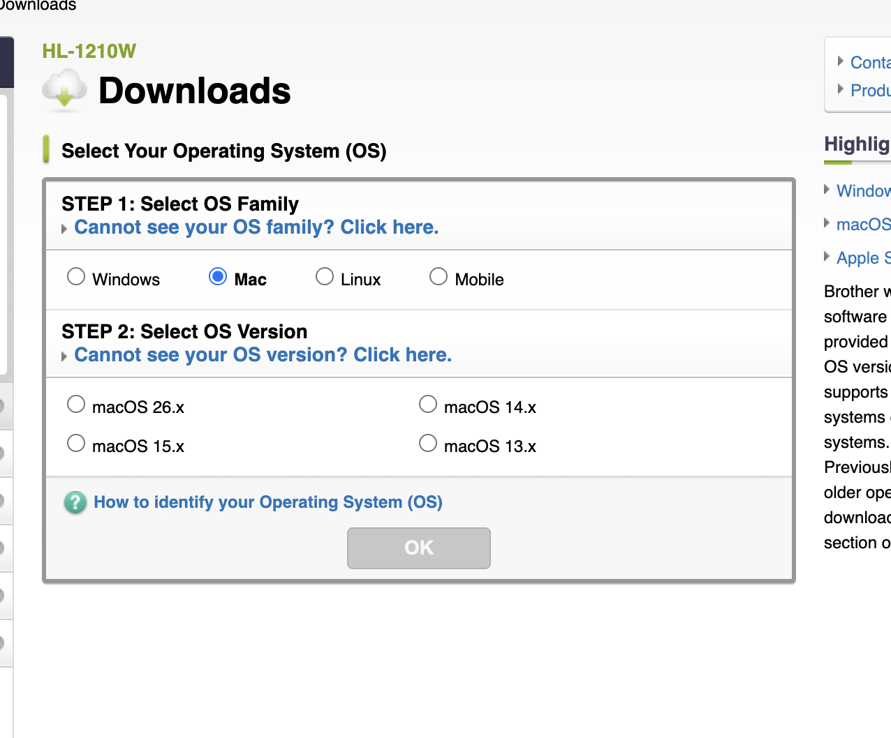
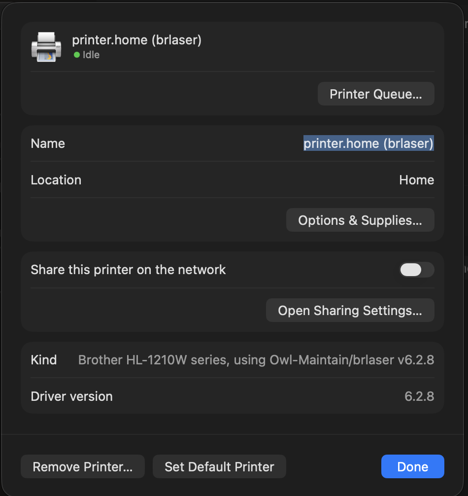

The macOS 27 Golden Gate update went smoothly. Then I tried to print a document.



Removing the printer and adding it back failed as well, with the same message:



"The printer software is not compatible with this device" tells you nothing. The CUPS log is
more useful:

```bash
tail -60 /var/log/cups/error_log
```

```text
execv of /Library/Printers/Brother/Filter/rastertobrother1210.bundle/Contents/MacOS/rastertobrother1210
  failed. err:86, Bad CPU type in executable
STATE: +com.apple.badarch-error
```

## The cause

The printer is a Brother HL-1210W, a cheap host-based laser. It doesn't speak PCL, PostScript or
AirPrint, so macOS can't use a generic driver for it. The Mac has to render every page into
Brother's own format, and Brother's filter does that step.

That filter is an Intel binary from 2019:

```bash
lipo -archs /Library/Printers/Brother/Filter/rastertobrother1210.bundle/Contents/MacOS/rastertobrother1210
# x86_64
```

On Apple Silicon it has always run under Rosetta. After the update, Rosetta was gone:

```bash
arch -x86_64 /usr/bin/true
# arch: posix_spawnp: /usr/bin/true: Bad CPU type in executable
```

## Quick fix: reinstall Rosetta

```bash
sudo softwareupdate --install-rosetta --agree-to-license
```

Then add the printer again. It printed.

That only lasts as long as Rosetta does. Golden Gate is the
[last macOS with full Rosetta 2 support](https://en.wikipedia.org/wiki/MacOS_Golden_Gate), so I
went looking for a native driver.

## Brother has nothing newer

The [HL-1210W download page](https://support.brother.com/g/b/downloadtop.aspx?c=eu_ot&lang=en&prod=hl1210w_eu_as)
lists macOS up to 26.x. The package it offers, `Brother_PrinterDrivers_MonochromeLaser 1.5.0`,
is the one I already had. Inside, the filter is the same May 2019 `x86_64` binary.



## brlaser

[brlaser](https://github.com/pdewacht/brlaser) is an open-source CUPS driver for Brother
lasers that don't speak a standard printer language. The original repo hasn't moved since 2023.
The maintained fork, [Owl-Maintain/brlaser](https://github.com/Owl-Maintain/brlaser), is active,
and its README lists the **HL-1210W series** by name.

Linux distros ship it as a package. There's nothing for macOS: no Homebrew formula and no
binary release, only source. macOS already has what the build needs, though: the CUPS headers
come with the Command Line Tools, and `ppdc` (which generates the printer description file,
the PPD) is in `/usr/bin`. The only missing piece is `cmake`.

### Supported printers

The HL-1210W is only one of them. This guide works the same for every monochrome laser on
this list, copied from the [brlaser v6.2.8 README](https://github.com/Owl-Maintain/brlaser/blob/v6.2.8/README.md#supported-printers).
Colour lasers and inkjets will not work.

<details>
<summary><strong>All 100 supported printers</strong></summary>

- Brother DCP-1510 series
- Brother DCP-1600 series
- Brother DCP-1610W series
- Brother DCP-7010
- Brother DCP-7020
- Brother DCP-7030
- Brother DCP-7040
- Brother DCP-7055
- Brother DCP-7055W
- Brother DCP-7060D
- Brother DCP-7065DN
- Brother DCP-7070DW
- Brother DCP-7080
- Brother DCP-7080D
- Brother DCP-8065DN
- Brother DCP-B7500D series
- Brother DCP-L2500D series
- Brother DCP-L2510D series
- Brother DCP-L2520D series
- Brother DCP-L2520DW series
- Brother DCP-L2537DW
- Brother DCP-L2540DW series
- Brother DCP-L2550DW series
- Brother DCP-L2560DW series
- Brother FAX-2820
- Brother FAX-2840
- Brother HL-1110 series
- Brother HL-1200 series
- Brother HL-1210W series
- Brother HL-1430 series
- Brother HL-2030 series
- Brother HL-2130 series
- Brother HL-2140 series
- Brother HL-2150N
- Brother HL-2220 series
- Brother HL-2230 series
- Brother HL-2240 series
- Brother HL-2240D series
- Brother HL-2250DN series
- Brother HL-2260
- Brother HL-2260D
- Brother HL-2270DW series
- Brother HL-2280DW
- Brother HL-5030 series
- Brother HL-5040 series
- Brother HL-5140 series
- Brother HL-5250DN series
- Brother HL-5350DN series
- Brother HL-5370DW series
- Brother HL-5450DN series
- Brother HL-L1232W
- Brother HL-L2300D series
- Brother HL-L2305 series
- Brother HL-L2310D series
- Brother HL-L2320D series
- Brother HL-L2325DW
- Brother HL-L2335D series
- Brother HL-L2340D series
- Brother HL-L2350DW series
- Brother HL-L2360D series
- Brother HL-L2370DN series
- Brother HL-L2375DW series
- Brother HL-L2380DW series
- Brother HL-L2390DW
- Brother HL-L2400D
- Brother HL-L2400DW
- Brother HL-L2400DWE
- Brother HL-L2402D
- Brother HL-L2405W
- Brother HL-L2440DW
- Brother HL-L2460DW
- Brother HL-L2480DW
- Brother HL-L5000D series
- Brother MFC-1810 series
- Brother MFC-1910W series
- Brother MFC-7240
- Brother MFC-7320
- Brother MFC-7340
- Brother MFC-7360N
- Brother MFC-7365DN
- Brother MFC-7420
- Brother MFC-7440N
- Brother MFC-7460DN
- Brother MFC-7860DW
- Brother MFC-8440
- Brother MFC-8710DW
- Brother MFC-8860DN
- Brother MFC-9160
- Brother MFC-L2685DW
- Brother MFC-L2690DW
- Brother MFC-L2700DN series
- Brother MFC-L2700DW series
- Brother MFC-L2710DN series
- Brother MFC-L2710DW series
- Brother MFC-L2740DW series
- Brother MFC-L2750DW series
- Brother MFC-L2800DW
- Brother MFC-L5800DW series
- Fuji Xerox DocuPrint P265 dw
- Lenovo LJ2650DN

</details>

## Skip the build: precompiled download

I host a precompiled package here on mastori.dev:
**[brlaser-6.2.8-macos-universal.tar.gz](/downloads/brlaser-6.2.8-macos-universal.tar.gz)**
(100 KB, [SHA-256](/downloads/brlaser-6.2.8-macos-universal.tar.gz.sha256)).

It contains a universal binary that runs on Apple Silicon and Intel with macOS 11 or later.
Inside are the filter, a PPD for every model in brlaser's driver file (102), `install.sh` / `uninstall.sh`,
and the full brlaser source with its GPL licence.

```bash
shasum -a 256 brlaser-6.2.8-macos-universal.tar.gz
# 2a5e797366a3dfbd7282b02bd9289b368c64e12a5c830c1060216a8fc7eb590d
tar xzf brlaser-6.2.8-macos-universal.tar.gz
cd brlaser-6.2.8-macos-universal
sudo ./install.sh
```

Then add the printer in System Settings > Printers & Scanners. Under **Use > Select Software**,
pick "*your model*, using Owl-Maintain/brlaser v6.2.8".


**Disclaimer.** I did not write this driver. It is [Owl-Maintain/brlaser](https://github.com/Owl-Maintain/brlaser)
v6.2.8, compiled unmodified. I only changed the filter path in the PPDs. It is ad-hoc signed,
not notarized, and provided as is, with no warranty. I'm not responsible for anything it does
to your printer or your Mac. Install it at your own risk. If you don't trust a binary from a
stranger, build it yourself: the steps are below and take a minute.


## Building it

```bash
brew install cmake

curl -LO https://github.com/Owl-Maintain/brlaser/archive/refs/tags/v6.2.8.tar.gz
shasum -a 256 v6.2.8.tar.gz   # compare with the .sha256 on the release page
tar xzf v6.2.8.tar.gz && cd brlaser-6.2.8

cmake -S . -B build -DCMAKE_BUILD_TYPE=Release
cmake --build build
(cd build && ctest)           # 4/4 passed

lipo -archs build/rastertobrlaser
# arm64
```

The filter links only against system libraries (`libcups`, `libc++`, `libSystem`).

Generate the PPDs. The HL-1210W one is `br1210.ppd`:

```bash
cd build && mkdir ppd && ppdc -d ppd brlaser.drv
```

For another model, find its PPD by name and use that file in place of `br1210.ppd` below:

```bash
grep -l 'ModelName: "Brother HL-L2300D' ppd/*.ppd
# ppd/brl2300d.ppd
```

## Installing it

`cmake --install` would put the filter in `/usr/libexec/cups/filter`. On macOS that folder is
protected by System Integrity Protection, so you can't write to it. The filter goes under
`/Library/Printers` instead, like Brother's own, and the PPD points at it by absolute path:

```bash
sed -i '' 's#33 rastertobrlaser"#33 /Library/Printers/brlaser/filter/rastertobrlaser"#' ppd/br1210.ppd

sudo install -d -o root -g wheel -m 755 /Library/Printers/brlaser/filter
sudo install -o root -g wheel -m 755 rastertobrlaser /Library/Printers/brlaser/filter/
sudo install -o root -g wheel -m 644 ppd/br1210.ppd \
  "/Library/Printers/PPDs/Contents/Resources/Brother HL-1210W brlaser.ppd"

sudo lpadmin -p printer_home_brlaser -E -v ipp://printer.home/ \
  -P "/Library/Printers/PPDs/Contents/Resources/Brother HL-1210W brlaser.ppd" \
  -D "printer.home (brlaser)" -L Home
```

The filter must be owned by `root:wheel`, or CUPS refuses to run it. `lpadmin` warns that
"printer drivers are deprecated". CUPS prints that for every PPD-based printer, Brother's
included.

## Result



The test page printed fine. The printer now runs on a
native arm64 filter, so the next macOS release can drop Rosetta without taking it down.

If you have an older printer on an Apple Silicon Mac, check its filters now, before Rosetta goes
away. Anything that shows only `x86_64` depends on Rosetta:

```bash
find /Library/Printers -type f -perm +111 -ipath '*/filter/*' | while read -r f; do
  printf '%-28s %s\n' "$(basename "$f")" "$(lipo -archs "$f" 2>/dev/null)"
done | sort
```

```text
commandtobrother             x86_64
rastertobrlaser              arm64
rastertobrother1210          x86_64
...
```
