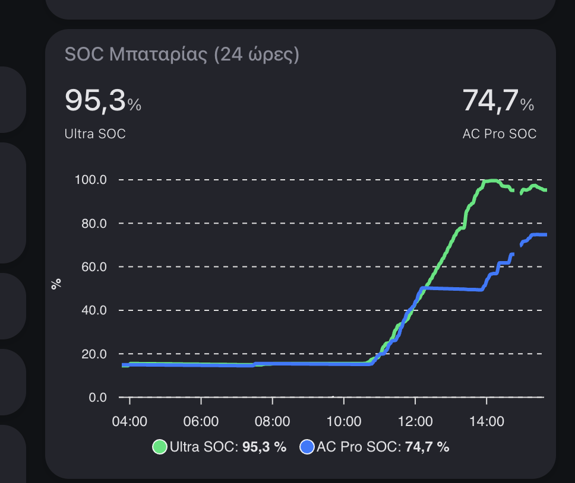
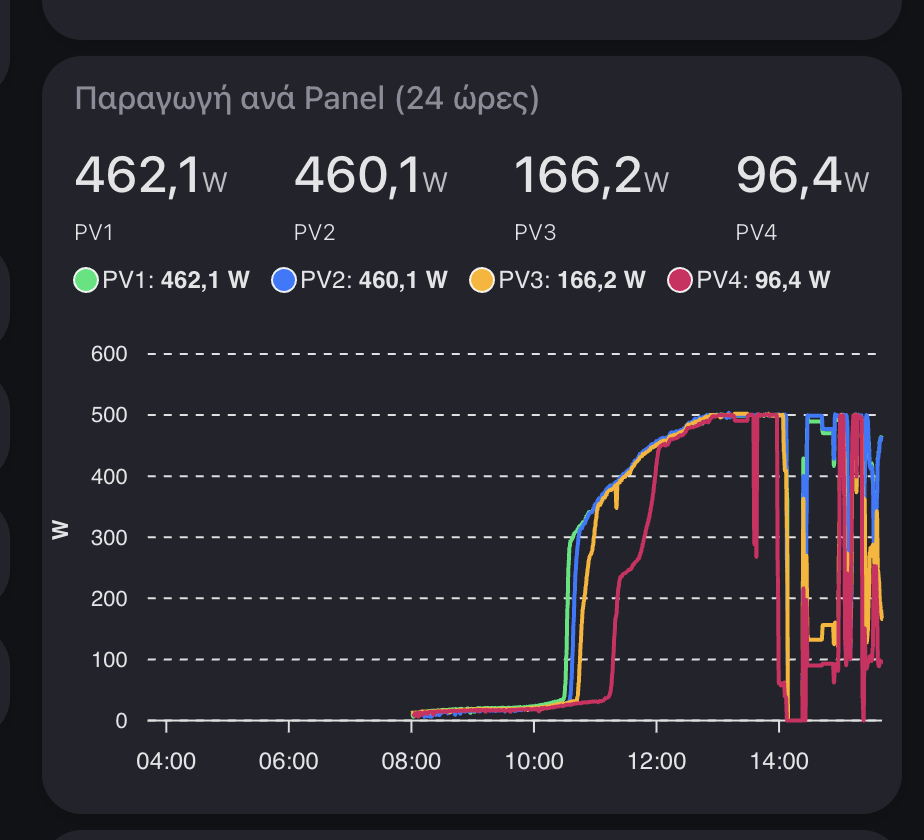
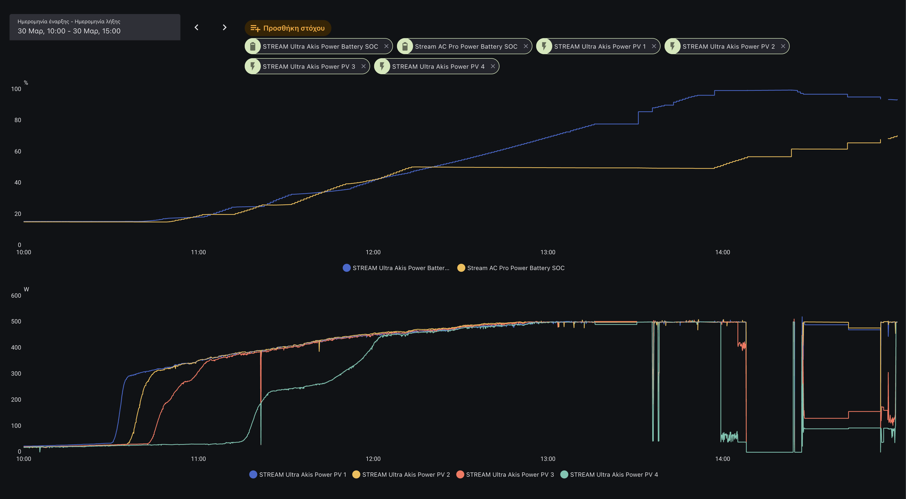

## My Setup

| Component | Model | Role |
|-----------|-------|------|
| **Stream Ultra** | EcoFlow Stream Ultra | Inverter + 1.92 kWh LFP battery + 4 MPPT solar inputs (up to 2000W) |
| **Stream AC Pro** | EcoFlow Stream AC Pro | Expansion battery — 1.92 kWh LFP, **no solar inputs, no inverter** |
| **Parallel Cable** | Official EcoFlow AC parallel cable | AC coupling between the two units |
| **Solar** | 4× 520W bifacial panels | ~2 kW peak, connected to Ultra's 4 MPPTs |
| **Smart Meter** | Shelly Pro 3EM | Zero-export / feed-in control |
| **Load** | go-e EV charger | ~1.4 kW at 6A single-phase |

I purchased the AC Pro to expand my system from 1.92 kWh to 3.84 kWh, based on EcoFlow's [product page](https://eu.ecoflow.com/pages/stream-series-plug-in-solar-battery) claims:

> *"Surplus solar energy automatically transfers between batteries"*
> *"AI-driven load balancing automatically redirects energy from nearby units"*

After weeks of data collection, I've found that none of this holds up under any sustained household load. And it's not a firmware bug — it's a **hardware architecture problem**.

## The Architecture: A 1200W Straw for 2000W of Solar

The AC Pro has **no solar inputs and no DC connection** to the Ultra. It charges exclusively through the AC parallel cable. The only path for solar energy to reach it is the Ultra's **1200W inverter**.


flowchart LR
    PV["☀️ Solar Panels\n2000W DC"] --> DC["Ultra DC Bus"]
    DC --> BAT["🔋 Ultra Battery\n1.92 kWh\nDC direct ~99%"]
    DC --> INV["⚡ Inverter\n1200W MAX"]
    INV --> AC["AC Circuit\n230V"]
    AC --> LOAD["🏠 House Load\ne.g. 1400W"]
    AC --> ACPRO["🔋 AC Pro\n1.92 kWh\nAC coupled"]

    style PV fill:#ca8a04,stroke:#eab308,color:#fff
    style BAT fill:#166534,stroke:#22c55e,color:#fff
    style INV fill:#991b1b,stroke:#ef4444,color:#fff
    style ACPRO fill:#1e3a5f,stroke:#3b82f6,color:#fff
    style LOAD fill:#6b7280,stroke:#9ca3af,color:#fff
    style DC fill:#374151,stroke:#6b7280,color:#fff
    style AC fill:#374151,stroke:#6b7280,color:#fff


When my EV charger draws 1400W, the inverter is **fully consumed serving the load** (1200W max, grid covers the 400W deficit). The remaining 800W of solar is trapped on the Ultra's DC bus with nowhere to go except the Ultra's battery. The AC Pro receives **0W**.


flowchart LR
    PV["☀️ 2000W"] --> DC["DC Bus"]
    DC -->|"800W trapped"| BAT["🔋 Ultra\n+800W ✅"]
    DC -->|"1200W max"| INV["⚡ Inverter"]
    INV -->|"1200W"| LOAD["🏠 Load 1400W"]
    GRID["🔌 Grid"] -->|"400W deficit"| LOAD
    ACPRO["🔋 AC Pro\n0W ❌"]

    style BAT fill:#166534,stroke:#22c55e,color:#fff
    style INV fill:#991b1b,stroke:#ef4444,color:#fff
    style ACPRO fill:#991b1b,stroke:#ef4444,color:#fff
    style LOAD fill:#6b7280,stroke:#9ca3af,color:#fff
    style PV fill:#ca8a04,stroke:#eab308,color:#fff
    style GRID fill:#374151,stroke:#6b7280,color:#fff
    style DC fill:#374151,stroke:#6b7280,color:#fff


When the Ultra eventually fills to 100%, the MPPT throttles from 2000W to 1200W — cutting 800W of solar permanently. The inverter keeps running to serve the load, but **800Wh per hour of sunshine is wasted** while the AC Pro sits partially empty.

**This isn't a firmware decision. It's physics.** `2000W solar - 1200W inverter = 800W trapped on the wrong side of the bottleneck.`

## The Evidence

Real data from March 30, 2026. Both batteries started at ~15%. EV surplus charging began at ~11:00.


  
  




```
🔋 Ultra: 99.3%   AC Pro: 56.2%   gap: 43%
☀️ PV: 1.2kW ← throttled from 2kW, 800W curtailed
```

## How a Typical Day Unfolds

Solar doesn't jump to 2000W at 10:00 — it ramps up through the day. The DC surplus to the Ultra is `Solar - 1200W (inverter)`. At 10:00 when the EV starts, solar may only be ~1200W, meaning the inverter takes **all** of it and the Ultra gets **0W** surplus. The full 800W surplus only appears when solar reaches peak ~2000W.

The critical factor: **season**. In summer, solar peaks earlier and harder — the Ultra fills fast and curtailment lasts hours. In spring, it fills later and curtailment is shorter.

### Spring Day (March, ~13.2 kWh total solar)

| Time | Solar | DC Surplus to Ultra | AC Pro | Curtailed |
|---|---|---|---|---|
| 08-10:00 | 300-1200W | Both charge from surplus | Both charge | 0 |
| 10:00 (EV) | ~1200W | **0W** (inverter takes all) | **0W** | 0 |
| 11:00 | ~1600W | +400W | **0W** | 0 |
| 12:00 | ~1800W | +600W | **0W** | 0 |
| 13:00 | ~1900W | +700W, Ultra ~86% | **0W** | 0 |
| **~13:30** | 1900W | **Ultra 100%** | **~35%** | **700W** |
| 13:30-15:00 | 1900-1400W | Full | ~35% | 700-200W |
| 15:00-16:00 | 1000W | Full | ~35% | 0W |
| 16:00 (EV off) | 900W | Full | Finally charges | 0 |
| 18:00 | — | 100% | **~76%** | — |

**Spring curtailment: ~1.2 kWh/day.** AC Pro never reaches 100%.

### Summer Day (June-July, ~15.4 kWh total solar)

| Time | Solar | DC Surplus to Ultra | AC Pro | Curtailed |
|---|---|---|---|---|
| 08-10:00 | 500-1700W | Both charge. Ultra reaches ~59% | Both charge | 0 |
| 10:00 (EV) | ~1700W | +500W | **0W** | 0 |
| 11:00 | ~2000W | +800W, Ultra ~85% | **0W** | 0 |
| **~11:22** | 2000W | **Ultra 100%** | **~40%** | **800W** |
| 11:22-13:00 | 2000-2080W | Full | ~40% | 800-880W |
| 13:00-15:00 | 2000-1600W | Full | ~40% | 800-400W |
| 15:00-16:00 | 1200W | Full | ~40% | 0W |
| 16:00 (EV off) | 1200W | Full | Charges fast | 0 |
| 17:20 | — | 100% | **100%** | — |

**Summer curtailment: ~3.3 kWh/day** over 4.6 hours. AC Pro catches up by 17:20.

### Yearly Impact

| Season | Ultra fills | Curtail hours | Daily waste | AC Pro end |
|--------|-----------|---------------|-------------|-----------|
| March/Sept | ~13:30 | ~2.5 hrs | **~1.2 kWh** | ~76% |
| April/May | ~12:30 | ~3.5 hrs | **~2.0 kWh** | ~90% |
| June-August | ~11:22 | ~4.6 hrs | **~3.3 kWh** | 100% |

On a typical sunny day — and Greece averages **250+ sunny days per year** — the system wastes roughly **3 kWh of solar production**. That adds up:

- **~3 kWh/day × 30 days = ~90 kWh/month**
- **~90 kWh × 12 months = ~1,080 kWh/year**
- At the Greek electricity rate of €0.15/kWh: **~€160/year in lost self-consumption**

Over the system's expected 10-year lifespan, that's **~10,800 kWh and ~€1,600** of solar energy produced by your panels but thrown away because the architecture can't deliver it to the expansion battery you paid for.

And that's just the direct energy loss. The Ultra also accumulates **2-3x more charge cycles** than the AC Pro, accelerating degradation on the more expensive unit — the one with the inverter and MPPT that you can't replace with a €620 AC Pro.

## It Gets Worse With More Units

EcoFlow markets "expandable to 11.52 kWh" (6 units) and "expandable to 23 kWh" (Ultra X, 6 units). Same 1200W bottleneck:

| Setup | Total Capacity | Usable Under Load | Dead Capacity |
|---|---|---|---|
| 1 Ultra + 1 AC Pro | 3.84 kWh | 1.92 kWh | **50%** |
| 1 Ultra + 2 AC Pro | 5.76 kWh | 1.92 kWh | **67%** |
| 1 Ultra + 5 AC Pro | 11.52 kWh | 1.92 kWh | **83%** |

With 6 units, **5 out of 6 batteries get 0W** under load. The Ultra fills in ~3.5 hours (surplus ramps from 0W to 800W as solar peaks), then 800W is curtailed while 9.6 kWh of empty storage sits idle. Even with zero load, charging 5 AC Pros through a 1200W inverter at 87% efficiency takes **over 9 hours** — longer than a winter solar day in Greece.

## Not Just Stream — Same Problem Across EcoFlow Products

- **Delta Pro + Extra Battery** ([DIY Solar Forum](https://diysolarforum.com/threads/eco-flow-delta-pro-2x-extra-batts-uneven-discharge.45039/)): Delta Pro at 1.5% while extras at 20% and 60%. EcoFlow: *"Differences < 20% are normal."*
- **Stream Ultra + AC Pro** ([VanTour review](https://www.vantour.net/ecoflow-stream-ultra-review-test-discount-code/)): AC Pro stuck at 0%, never charged — completely ignored by the system.
- **PowerStream** ([MakeUseOf](https://www.makeuseof.com/ecoflow-powerstream-review/)): Solar curtailed when battery full, no redirect to expansion.

EcoFlow [patented a parallel battery equalization solution](https://patents.google.com/patent/US20190013680A1/en) in 2017 (PWM duty-cycle controlled current distribution). **The patent was abandoned** and never implemented.

## The BMS: Each Unit Is an Island

Each unit runs a **TI BQ76952** battery monitor ([source: iFixit](https://www.ifixit.com/Wiki/ecoflow_field_manual)) with a GD32F10x MCU. The BQ76952 monitors only its own 16S cell string — it has **zero awareness of other packs**. No inter-chip communication, passive-only cell balancing (50-200mA within the pack), and SoC estimation left entirely to the MCU. Inter-unit communication is WiFi only — no CAN bus, no shared voltage bus.

This is normal for battery systems. What's not normal is the firmware doing nothing with the data it has.

## Best Firmware Workaround: "AC Pro First"

The 1200W bottleneck can't be fixed with firmware, but its impact can be reduced.

**Charge the AC Pro first during morning low-load hours**, then fall back to Ultra when load kicks in. The Ultra starts the load period at ~15% instead of ~35%, needing ~1.63 kWh instead of ~1.25 kWh to fill — pushing the point of curtailment later into the afternoon when solar is already declining.

| Metric | Current Firmware | AC Pro First |
|--------|-----------------|-------------|
| Ultra SoC at EV start | ~35% | **~15%** |
| Ultra fills at | ~13:30 | **~14:30** |
| AC Pro end SoC | ~85% | **100%** |
| Solar curtailed | ~1.0-1.5 kWh | **~0.5 kWh** |
| Both batteries full | AC Pro never reaches 100% | **Both 100% by 17:00** |

**This is a workaround, not a solution.** The 800W hardware tax remains. But it's the best achievable outcome with current hardware.

## What EcoFlow Should Do

1. **Implement "AC Pro First" charging priority** during low-load periods — simple firmware change, no hardware needed
2. **Add a Battery Priority setting** — let users choose: AC Pro First / Ultra First / Balanced
3. **Be transparent about the 1200W bottleneck** — "automatically transfers between batteries" is misleading when any load > 1200W blocks all transfer
4. **Address the scaling claims** — marketing "expandable to 11.52 kWh" without disclosing that expansion batteries can't charge under load is a material omission

## How to Reproduce

1. Start both batteries at similar SOC (~15%)
2. Let them charge from solar under low load — they'll track together
3. Turn on any sustained load > 500W
4. Watch Ultra SOC climb while AC Pro stalls
5. Wait for Ultra to hit 100% — observe PV drop from ~2000W to ~1200W

```
sensor.stream_ultra_*_power_battery_soc    # Ultra SOC
sensor.stream_ac_pro_power_battery_soc      # AC Pro SOC
sensor.stream_ultra_*_power_pv_sum          # Total PV production
```

## Call to Action

If you observe this behavior:

1. **Report to EcoFlow support** — reference: *"Under load > 1200W, AC Pro receives 0W from solar due to inverter bottleneck"*
2. **Post data** in the [EcoFlow community forum](https://community.ecoflow.com/)
3. **Reference EU Directive 2019/771** if you purchased the AC Pro based on the "automatic energy transfer" claims — goods must conform to the seller's advertising
4. **Consider the [Stream Ultra X](https://eu.ecoflow.com/products/stream-ultra-x)** (3.84 kWh single unit) instead — it eliminates the inter-unit bottleneck

---

*Updated April 1, 2026: Added root cause architecture analysis, scaling analysis, community reports, BMS details, and "AC Pro First" workaround. Original post: March 30, 2026.*

*PV surplus automation: [PV Surplus EV Charging — The Zero-Export Adventure](/posts/pv-surplus-ev-charging/). If you found this useful, share it — visibility drives fixes.*
