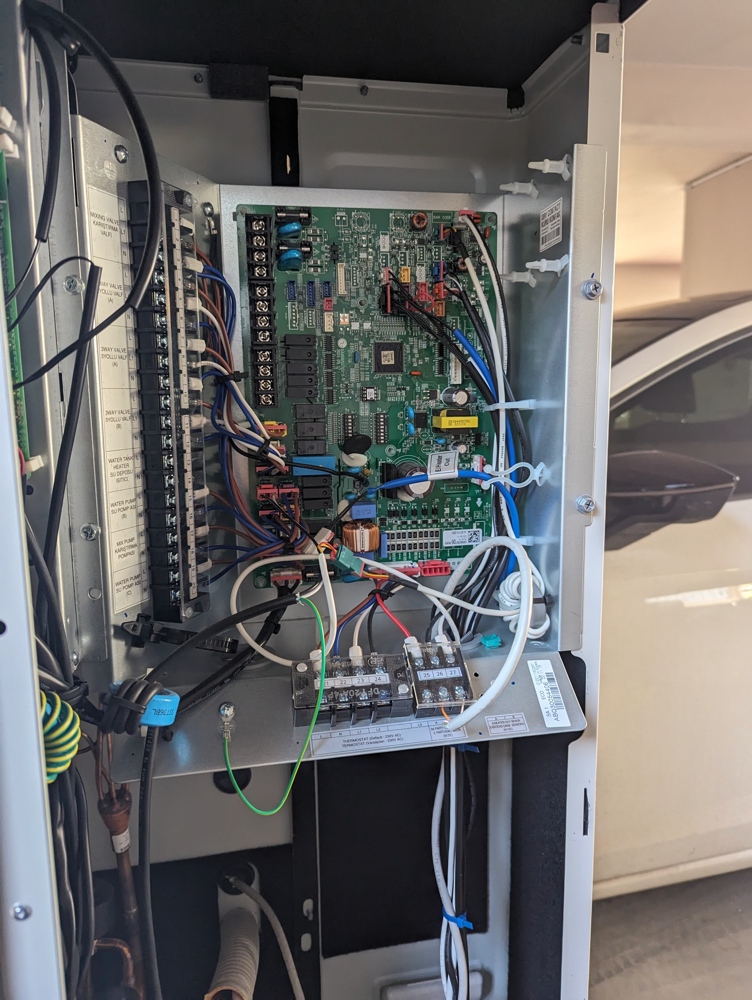
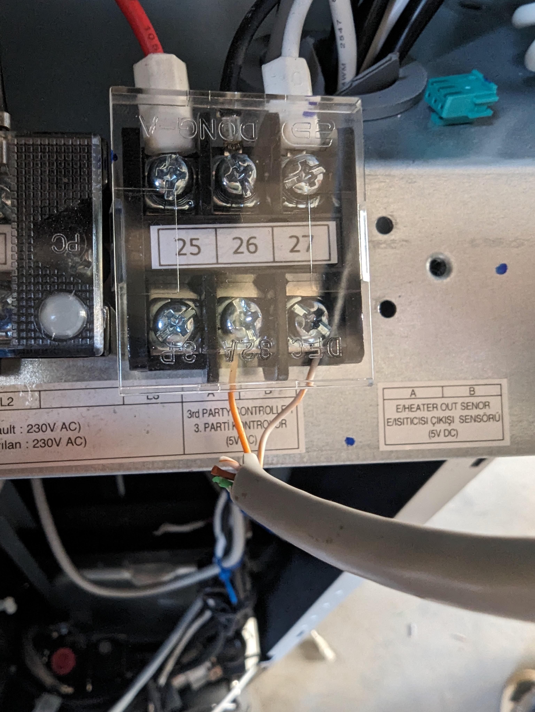
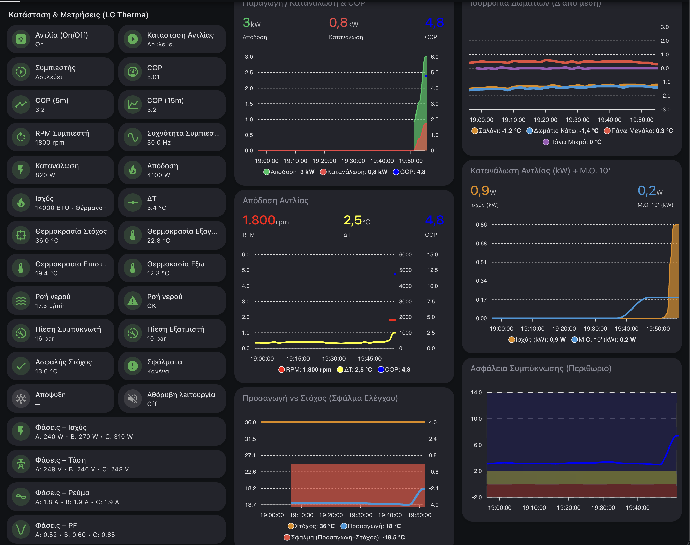
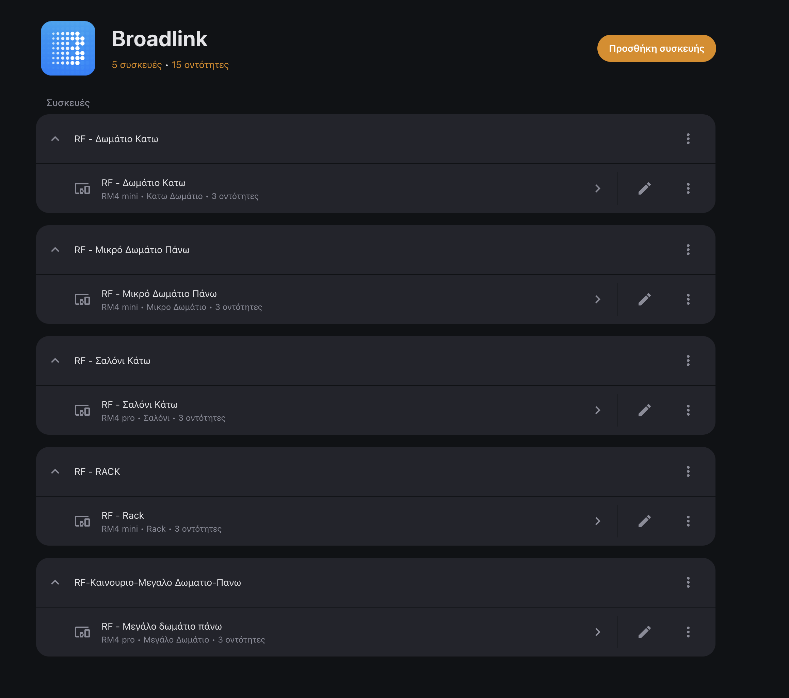
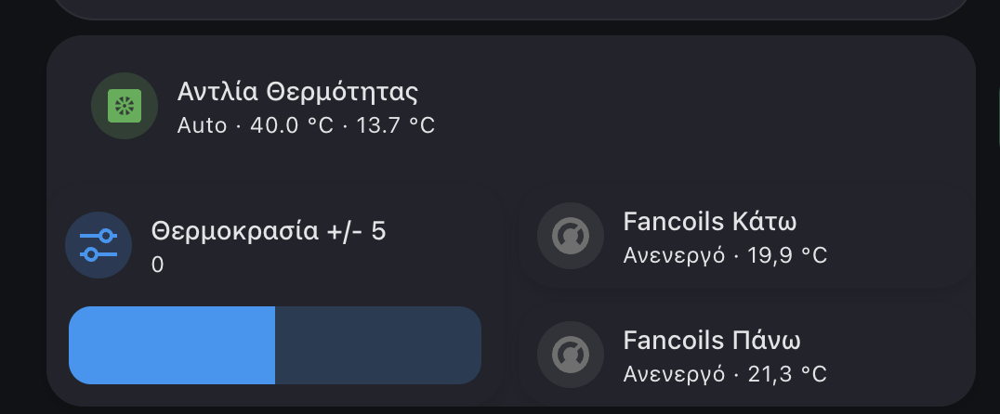
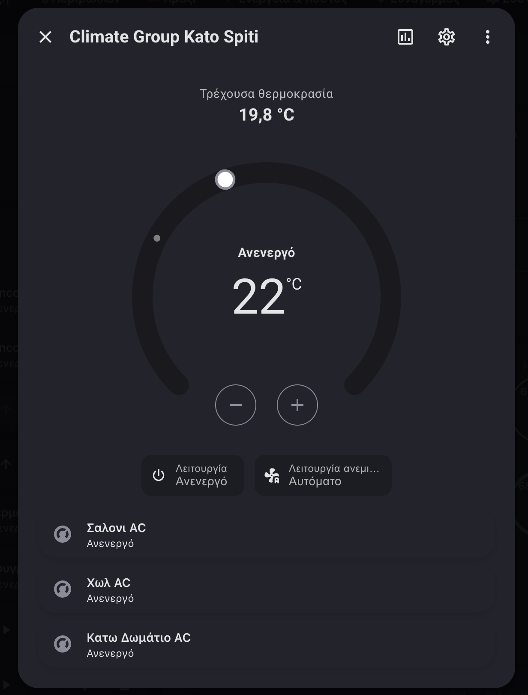
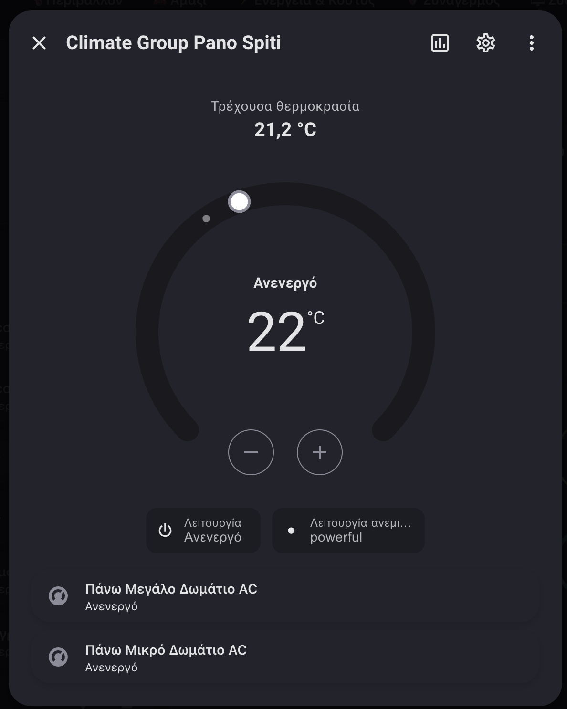
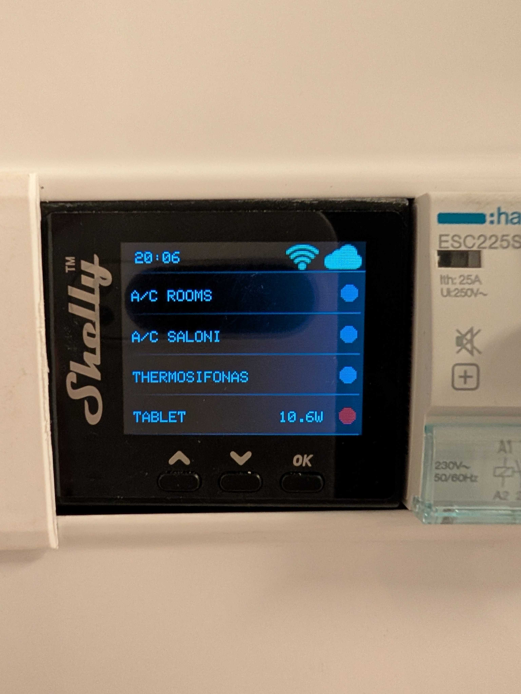
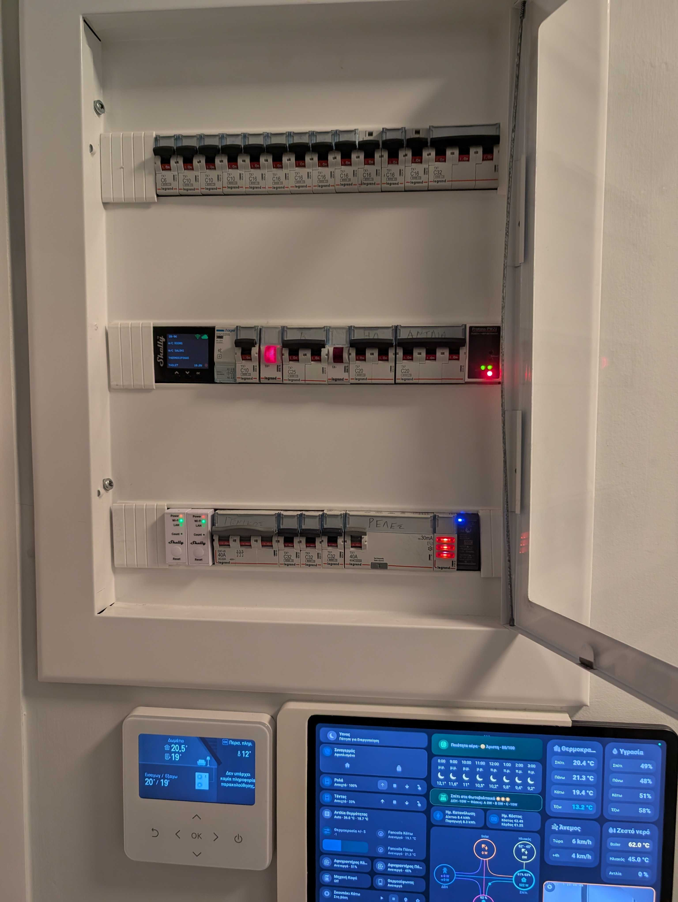

## The System

My house runs on an [LG Therma V](https://www.lg.com/gr/business/monobloc) air-to-water heat pump. It heats or cools water that circulates through 5 Daikin fancoil units — wall-mounted units in the living room, hallway, and three bedrooms across two floors.

The problem: these are all separate, disconnected systems. The heat pump has its own controller. Each fancoil has its own IR remote. Nothing talks to anything else. If you turn on the heat pump but forget to switch on the fancoils, you're heating water that nobody uses. If you turn off the pump but leave the fancoils running, they blow room-temperature air.

I wanted one system that coordinates everything. No more walking around the house with 5 different remotes. No more forgetting to turn on a fancoil in the bedroom. One button to turn on the climate, one button to turn it off — and ideally, one that doesn't blow cold air at me while the pump is still warming up.

## The Three Integration Layers

### Layer 1: LG Therma V via Modbus TCP

The Therma V has a Modbus port on its PCB, but it doesn't speak TCP natively. To bridge it to the network, I use an el-cheapo [BOROCO Protoss Modbus to TCP converter](https://www.amazon.de/dp/B09XV6Z96K) (based on the [HF-PE11](http://www.hi-flying.com/pe11) chipset) — a small box that connects to the heat pump's Modbus port via a UTP cable running from the electrical panel to the outdoor unit, and exposes it as Modbus TCP on port 8899 over WiFi. From there, Home Assistant's built-in [Modbus integration](https://www.home-assistant.io/integrations/modbus/) connects directly — no cloud, no proprietary gateway, pure local control.





What I get from Modbus:

| Register | Sensor | Use |
|----------|--------|-----|
| Discrete input 1 | Pump status | Is the pump running? |
| Discrete input 3 | Compressor status | Is the compressor active? |
| Input register 2 | Inlet temperature | Water returning from fancoils |
| Input register 12 | Outdoor air temp | For heating/cooling mode detection |
| Holding register 2 | Target temperature | Read/write setpoint |
| Holding register 4 | AI shift | Fine-tune the AI control offset |
| Coil 0 | Power on/off | Start/stop the heat pump |
| Coil 2 | Silent mode | Toggle quiet operation |

Plus compressor RPM, evaporator/compressor pressure, flow rate, defrost status, error status, and DHW (hot water) status. Full visibility into the heat pump's internals.



#### The Modbus Two's Complement Trick

The AI shift register (holding register 4) supports negative values (-5 to +5°C offset). But Modbus registers are unsigned 16-bit integers. Negative values are stored as two's complement — so -3 becomes 65533.

Reading it back into HA requires the reverse conversion:

```yaml
# Modbus → HA slider (unsigned to signed)
value: >-
  
  
    {{ raw - 65536 }}
  
    {{ raw }}
  

# HA slider → Modbus (signed to unsigned)
value: >-
  
  
    {{ val + 65536 }}
  
    {{ val }}
  
```

Two automations keep the HA slider and the Modbus register in bidirectional sync, with guards to prevent feedback loops.

### Layer 2: Daikin Fancoils via Broadlink IR + SmartIR

The 5 Daikin fancoil units have no network connectivity — only IR remotes. The solution: [Broadlink RM4](https://www.ibroadlink.com/) IR blasters, one per room (5 total: 3× RM4 mini, 2× RM4 pro), paired with the [SmartIR](https://github.com/smartHomeHub/SmartIR) custom component.



SmartIR turns each Broadlink + fancoil combination into a proper `climate` entity in HA — with temperature control, fan modes, and HVAC modes. It works by storing a database of IR codes and sending the right one for each state combination.

**The hard part: learning the IR codes.** My Daikin fancoils weren't in SmartIR's device database. I had to learn every IR code manually — pressing each button combination on the physical remote while the Broadlink recorded the signal. Every temperature step, every fan speed, every mode. Then I contributed the codes back to the project:

**[SmartIR PR #1162 — Daikin fancoil support](https://github.com/smartHomeHub/SmartIR/pull/1162)**

The SmartIR config for each fancoil looks like this:

```yaml
climate:
  - platform: smartir
    name: Living Room AC
    unique_id: living_room_ac
    device_code: 3241
    controller_data: remote.rf_living_room
    temperature_sensor: sensor.rf_living_room_temperature
    humidity_sensor: sensor.rf_living_room_humidity
    power_sensor: switch.shelly_rack_switch_1
    power_sensor_restore_state: true
```

Each Broadlink also has a built-in temperature and humidity sensor — which SmartIR uses for the climate entity's current readings.

### Layer 3: Climate Groups

With 5 individual climate entities, controlling the house means tapping 5 different cards. The [climate_group](https://github.com/bjrnptrsn/climate_group) custom component solves this — it groups multiple climate entities into a single virtual thermostat:

```yaml
climate:
  - platform: climate_group
    name: 'Climate Group Downstairs'
    temperature_unit: C
    entities:
      - climate.saloni_ac
      - climate.khol_ac
      - climate.kato_domatio_ac

  - platform: climate_group
    name: 'Climate Group Upstairs'
    temperature_unit: C
    entities:
      - climate.pano_megalo_domatio_ac
      - climate.pano_mikro_domatio_ac
```

Set the temperature on the group → all fancoils in that group follow. One control per floor.







Each climate group shows the individual fancoils underneath — you can see exactly which units are part of the group and their current state. Set the temperature on the group, and all units follow. The family sees two thermostats, not five remotes.

### Hardware Layer: Shelly Pro 4PM for Power Control

The fancoils are powered through a [Shelly Pro 4PM](https://us.shelly.com/products/shelly-pro-4pm) in the electrical panel — two channels, one for the downstairs circuit and one for upstairs. This gives us two things: a hard on/off switch that the automations use to start and stop the fancoils, and per-circuit power monitoring so we can track exactly how much energy the HVAC system consumes.





## The Automation: Don't Blow Cold Air

This is the automation that ties everything together. The problem it solves: when the heat pump starts, the water needs several minutes to reach the target temperature. If the fancoils start immediately, they blow cold (or warm) air until the water is ready.

### Start Fancoils Only When Water is Ready

The automation checks every minute. After the pump has been on for at least 4 minutes, it evaluates whether the water temperature has reached the setpoint — but it needs to know whether the system is **heating or cooling** to compare correctly:

```yaml
# Mode detection from outdoor temperature

  

  

  # Grey zone: use delta-T between outlet and inlet
  
  
    
  
    
  
    
  


# Ready check based on produced water temperature

  {{ outlet <= (setpoint + 0.5) }}

  {{ outlet >= (setpoint - 0.5) }}

```

The 15-25°C grey zone is tricky — outdoor temperature alone doesn't tell you if you're heating or cooling. The fallback uses the delta-T between outlet and inlet water: if outlet is warmer than inlet, you're heating; if cooler, you're cooling.

When the water is ready → turn on the Shelly relays that power the fancoil circuit → Telegram notification.

### Stop Fancoils When Pump Stops

When the pump turns off, the automation waits 4 minutes (to use the remaining heated/cooled water) then turns off the fancoil relays. The stop sequence includes a quirky on-off-on-off power cycle — this resets the fancoil valve state so they don't get stuck in an intermediate position.

## The Result

The whole system works as one unit now:

1. **Turn on the heat pump** (from HA, physical switch, or schedule)
2. **Wait for water to reach temperature** — fancoils stay off, no cold air
3. **Fancoils start automatically** — Telegram notification confirms
4. **Control per floor** via climate groups — one slider per floor
5. **Turn off the pump** → fancoils stop automatically after 4 minutes

No more forgetting to turn on fancoils. No more cold air blasts. No more leaving fancoils running after the pump is off.

The Broadlink IR blasters give full climate control over units that were never designed to be smart. The Modbus connection gives deep visibility into the heat pump's state. And the climate groups make it manageable for the rest of the family — they see two thermostats (upstairs, downstairs), not five individual units.

## Appendix: Fancoil Automations + AI Shift Sync

<details>
<summary>Click to expand — Start Fancoils When Water is Ready</summary>

```yaml
alias: "Heat Pump — Start Fancoils When Ready"
triggers:
  - minutes: /1
    trigger: time_pattern

conditions:
  # Pump has been on for at least 4 minutes
  - condition: state
    entity_id: switch.lg_therma_power
    state: "on"
    for:
      minutes: 4

  # At least one fancoil relay is off
  - condition: or
    conditions:
      - condition: state
        entity_id: switch.fancoil_relay_downstairs
        state: "off"
      - condition: state
        entity_id: switch.fancoil_relay_upstairs
        state: "off"

  # Water temperature has reached setpoint (mode-aware)
  - condition: template
    value_template: >-
      
      
      
      
      
      

      {# Mode detection #}
      
        
      
        
      
        
        
          
        
          
        
          
        
      

      {# Ready check #}
      
        {{ outlet <= (setpoint + band) }}
      
        {{ outlet >= (setpoint - band) }}
      
        false
      

actions:
  - action: switch.turn_on
    target:
      entity_id:
        - switch.fancoil_relay_downstairs
        - switch.fancoil_relay_upstairs
  - action: notify.send_message
    target:
      entity_id: notify.your_telegram_bot
    data:
      title: "Heat Pump"
      message: "Water reached temperature. Fancoils ON."

mode: single
```

</details>

<details>
<summary>Click to expand — Stop Fancoils When Pump Stops</summary>

```yaml
alias: "Heat Pump — Stop Fancoils"
triggers:
  - minutes: /1
    trigger: time_pattern

conditions:
  # Pump has been off for at least 4 minutes
  - condition: state
    entity_id: switch.lg_therma_power
    state: "off"
    for:
      minutes: 4

  # At least one fancoil relay is still on
  - condition: or
    conditions:
      - condition: state
        entity_id: switch.fancoil_relay_downstairs
        state: "on"
      - condition: state
        entity_id: switch.fancoil_relay_upstairs
        state: "on"

actions:
  - action: notify.send_message
    target:
      entity_id: notify.your_telegram_bot
    data:
      title: "Heat Pump"
      message: "Pump stopped. Turning off fancoils."

  # Turn off
  - action: switch.turn_off
    target:
      entity_id:
        - switch.fancoil_relay_downstairs
        - switch.fancoil_relay_upstairs

  # Valve reset cycle (on-off-on-off to prevent stuck valves)
  - delay: "00:00:10"
  - action: switch.turn_on
    target:
      entity_id:
        - switch.fancoil_relay_downstairs
        - switch.fancoil_relay_upstairs
  - delay: "00:00:06"
  - action: switch.turn_off
    target:
      entity_id:
        - switch.fancoil_relay_downstairs
        - switch.fancoil_relay_upstairs

mode: single
```

</details>

<details>
<summary>Click to expand — Enforce AI Control on HA Startup</summary>

```yaml
alias: "Therma V — Enforce AI Control on Startup"
triggers:
  - event: start
    trigger: homeassistant

actions:
  # Write register 1 = 514 to force AI control mode
  - action: modbus.write_register
    data:
      hub: "Heat Pump - LG Therma V"
      slave: 1
      address: 1
      value: 514

mode: single
```

</details>

<details>
<summary>Click to expand — AI Shift Bidirectional Sync (HA slider ↔ Modbus)</summary>

```yaml
# --- HA Slider → Modbus ---
alias: "LG Therma AI Shift to Modbus"
triggers:
  - platform: state
    entity_id: input_number.lg_ai_shift

conditions:
  - condition: template
    value_template: >-
      
      
      
        true
      
        
        
        {{ slider != raw }}
      

actions:
  - action: modbus.write_register
    data:
      hub: "Heat Pump - LG Therma V"
      address: 4
      unit: 1
      value: >-
        
        {{ val + 65536 }}{{ val }}

mode: single
```

```yaml
# --- Modbus → HA Slider ---
alias: "LG Therma AI Shift from Modbus"
triggers:
  - platform: state
    entity_id: sensor.lg_therma_ai_shift_raw

conditions:
  - condition: template
    value_template: >-
      {{ states('sensor.lg_therma_ai_shift_raw') not in ['unknown', 'unavailable'] }}

actions:
  - action: input_number.set_value
    data:
      entity_id: input_number.lg_ai_shift
      value: >-
        
        {{ raw - 65536 }}{{ raw }}

mode: single
```

</details>

## Appendix: Full Modbus Configuration for LG Therma V

<details>
<summary>Click to expand — LG Therma V Modbus YAML</summary>

```yaml
modbus:
  - name: "Heat Pump - LG Therma V"
    delay: 1
    timeout: 14
    message_wait_milliseconds: 200
    host: YOUR_HEAT_PUMP_IP
    port: 8899
    type: tcp

    binary_sensors:
      - name: "lg_therma_heating_mode"
        address: 0
        scan_interval: 60
        slave: 1
        input_type: coil

      - name: "lg_therma_flow_too_low"
        address: 0
        scan_interval: 60
        slave: 1
        input_type: discrete_input

      - name: "lg_therma_pump_status"
        address: 1
        scan_interval: 10
        slave: 1
        input_type: discrete_input
        device_class: running

      - name: "lg_therma_compressor_status"
        address: 3
        scan_interval: 10
        slave: 1
        input_type: discrete_input
        device_class: running

      - name: "lg_therma_defrost_status"
        address: 4
        scan_interval: 60
        slave: 1
        input_type: discrete_input
        device_class: running

      - name: "lg_therma_dhw_status"
        address: 5
        scan_interval: 60
        slave: 1
        input_type: discrete_input
        device_class: running

      - name: "lg_therma_disinfect_status"
        address: 6
        scan_interval: 60
        slave: 1
        input_type: discrete_input
        device_class: running

      - name: "lg_therma_silent_status"
        address: 7
        scan_interval: 10
        slave: 1
        input_type: discrete_input

      - name: "lg_therma_error_status"
        address: 13
        scan_interval: 60
        slave: 1
        input_type: discrete_input
        device_class: problem

    sensors:
      - name: "lg_therma_inlet_temp"
        unique_id: "lg_therma_inlet_temp"
        scan_interval: 10
        address: 2
        slave: 1
        input_type: input
        scale: 0.1
        device_class: temperature
        unit_of_measurement: "°C"
        precision: 1

      - name: "lg_therma_flow_rate"
        unique_id: "lg_therma_flow_rate"
        scan_interval: 10
        address: 8
        slave: 1
        input_type: input
        scale: 0.1
        unit_of_measurement: "l/min"
        precision: 1

      - name: "lg_therma_outdoor_air_temp"
        unique_id: "lg_therma_outdoor_air_temp"
        scan_interval: 10
        address: 12
        slave: 1
        input_type: input
        scale: 0.1
        device_class: temperature
        unit_of_measurement: "°C"
        precision: 1

      - name: "lg_therma_compressor_rpm"
        unique_id: "lg_therma_compressor_rpm"
        scale: 60
        precision: 0.1
        scan_interval: 10
        address: 24
        slave: 1
        unit_of_measurement: rpm
        input_type: input

      - name: "lg_therma_evaporator_pressure"
        unique_id: "lg_therma_evaporator_pressure"
        address: 23
        scan_interval: 60
        unit_of_measurement: Bar
        slave: 1
        input_type: input
        scale: 0.01

      - name: "lg_therma_compressor_pressure"
        unique_id: "lg_therma_compressor_pressure"
        address: 22
        scan_interval: 60
        unit_of_measurement: Bar
        slave: 1
        input_type: input
        scale: 0.01

      - name: "lg_therma_ai_shift_raw"
        unique_id: "lg_therma_ai_shift_raw"
        address: 4
        slave: 1
        input_type: holding
        scan_interval: 4

    switches:
      - name: "lg_therma_power"
        slave: 1
        address: 0
        write_type: coil
        command_on: 1
        command_off: 0
        verify:
          input_type: coil
          address: 0
          state_on: 1
          state_off: 0

      - name: "lg_therma_silent_mode"
        slave: 1
        address: 2
        write_type: coil
        command_on: 1
        command_off: 0
        verify:
          input_type: coil
          address: 2
          state_on: 1
          state_off: 0

    climates:
      - name: "lg_therma_climate_control"
        address: 3
        slave: 1
        input_type: input
        max_temp: 50
        min_temp: 5
        offset: 0
        precision: 1
        scale: 0.1
        target_temp_register: 2
        temp_step: 1
        temperature_unit: C
        write_registers: true
        hvac_mode_register:
          address: 0
          values:
            state_cool: 0
            state_auto: 3
            state_heat: 4
```

</details>
