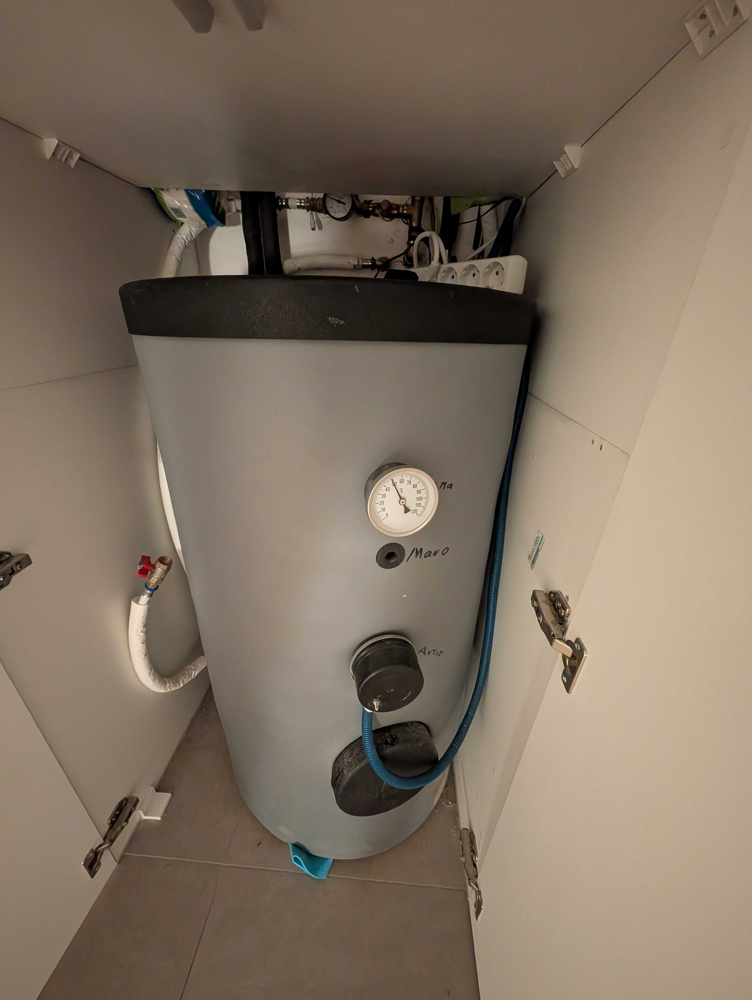
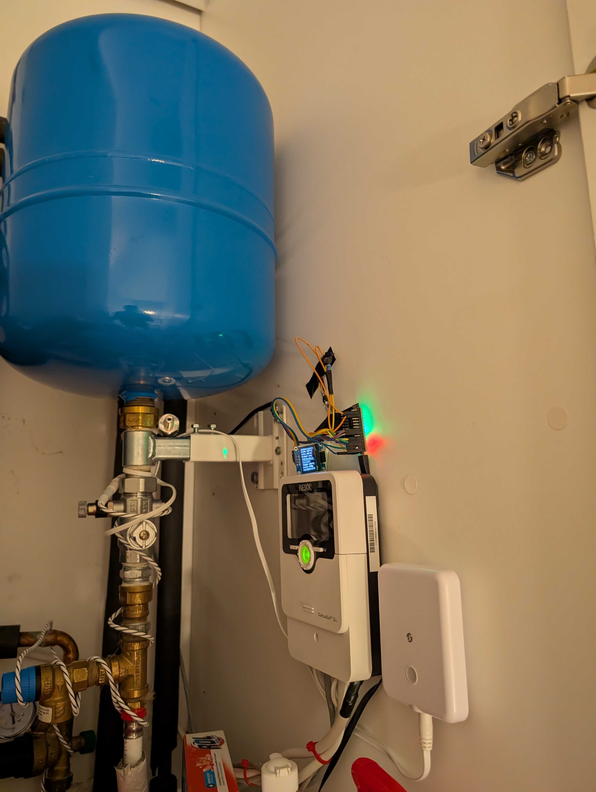

## The Problem

[Legionella pneumophila](https://www.cdc.gov/control-legionella/php/toolkit/potable-water-systems-module.html) is a bacterium that causes Legionnaires' disease — a severe form of pneumonia. It lives in water systems and multiplies in warm, stagnant water. You can get infected by inhaling contaminated water droplets from showers or faucets.

The [CDC recommends](https://www.cdc.gov/control-legionella/php/toolkit/potable-water-systems-module.html) storing hot water above 60°C (140°F) to prevent growth. The [temperature ranges](https://www.ncbi.nlm.nih.gov/books/NBK555112/) that matter:

| Temperature | What happens |
|-------------|-------------|
| **< 20°C** | Legionella survives but dormant |
| **20-45°C** | **Optimal growth — the danger zone** |
| **> 55°C** | Growth stops, slow kill |
| **> 60°C** | Rapid kill |
| **> 70°C** | Destroyed almost instantly |

My boiler's normal target is **50°C** — comfortable for daily use, but right at the edge. If the water sits at 40-50°C for days without reaching disinfection temperature, bacteria can multiply.


  
  


The standard prevention is **thermal shock** — periodically heating the water above 65°C. Many people do this manually or on a fixed weekly schedule, running the electric heater regardless of whether it's actually needed.

## Why a Fixed Schedule Wastes Energy

In summer, my [solar thermal system](/posts/boiler-solar-thermal-esphome-vbus-controller/) regularly pushes the boiler above 70°C — the sun does the disinfection for free. Running the electric heater on top of that wastes electricity for nothing.

In winter, solar might not reach 65°C for weeks — and that's exactly when disinfection matters most.

A smart automation should know the difference.

## The Smart Approach

Instead of heating blindly every week, the automation asks one question: **has the boiler been above 65°C at any point in the last 7 days?**

- If yes → solar already did the job. Skip and save electricity.
- If no → the sun wasn't strong enough. Run the disinfection cycle.


flowchart TD
    A["Sunday 20:00"] --> B{Sensors OK?}
    B -->|No| C["Notify + skip"]
    B -->|Yes| D{"Max temp last 7 days\n≥ 65°C?"}
    D -->|Yes| E["Skip — solar did the job"]
    D -->|No| F{"Current temp\n≥ 65°C?"}
    F -->|Yes| G["Skip — already hot"]
    F -->|No| H["Heat to 65°C"]
    H --> I["Wait for target\nor 1.5h timeout"]
    I --> J["Turn off + notify"]

    style E fill:#166534,stroke:#22c55e,color:#fff
    style G fill:#166534,stroke:#22c55e,color:#fff
    style H fill:#854d0e,stroke:#eab308,color:#fff
    style C fill:#991b1b,stroke:#ef4444,color:#fff


## Tracking the 7-Day Maximum

Home Assistant's built-in [statistics integration](https://www.home-assistant.io/integrations/statistics/) tracks the maximum boiler temperature over a rolling 7-day window:

```yaml
sensor:
  - platform: statistics
    name: "Boiler Max Temp 7 Days"
    entity_id: sensor.your_boiler_temperature
    state_characteristic: value_max
    max_age:
      days: 7
    sampling_size: 20000
    precision: 1
```

This sensor always holds the highest temperature the boiler reached in the last week. If it's ≥ 65°C, solar thermal handled the disinfection naturally. No helpers, no manual tracking — HA's recorder does the work.

## How It Works With the Existing Boiler Automation

The Legionella check runs **Sunday at 20:00** — during the evening heating window (18:00-22:00). The [existing boiler automation](/posts/boiler-solar-thermal-esphome-vbus-controller/) only fires if the temperature is **below 40°C and the heater is off**. If the Legionella cycle heats to 65°C first, the existing automation sees the temperature is well above 40°C and skips. No conflict.

## Real-World Data

Here's what the statistics sensor shows for my boiler right now:

- **7-day max: 72.5°C** — solar thermal heated the boiler well above the disinfection threshold
- **Current: 43°C** — cooled down naturally, sitting in the danger zone, but was disinfected within the week
- **Legionella cycle needed: No** — the sun did the work for free

In summer, this automation will almost never run. In winter or during extended cloudy periods — that's when the electric backup kicks in automatically.

## The Notifications

Every Sunday at 20:00, Telegram tells you what happened:

- **Sunny week:** "Δεν χρειάζεται απολύμανση. Ο θερμοσίφωνας έφτασε 72.5°C. Ο ήλιος τα κατάφερε."
- **Cloudy week:** "Ξεκινάω θερμική απολύμανση. Θερμοκρασία τώρα: 43°C, στόχος 65°C."
- **Complete:** "Απολύμανση ολοκληρώθηκε. Θερμοκρασία: 65.2°C."
- **Timeout:** "Δεν έφτασε τους 65°C σε 1:30. Τελική: 58°C."
- **Safety:** "Θερμοκρασία 76°C — safety cutoff."

## The Takeaway

The automation costs nothing to run in summer (solar handles it) and only uses electricity when genuinely needed (cloudy weeks in winter). One statistics sensor, one automation, one weekly check. The boiler stays safe, and you get a message every Sunday telling you whether the sun or the heater did the job.

## Appendix

<details>
<summary>Click to expand — Statistics Sensor YAML</summary>

```yaml
sensor:
  - platform: statistics
    name: "Boiler Max Temp 7 Days"
    entity_id: sensor.your_boiler_temperature
    state_characteristic: value_max
    max_age:
      days: 7
    sampling_size: 20000
    precision: 1
```

</details>

<details>
<summary>Click to expand — Legionella Prevention Automation YAML</summary>

```yaml
alias: "Legionella Prevention — Weekly Thermal Disinfection"
description: >-
  Weekly check (Sunday 20:00): if the boiler hasn't reached 65°C in the last 7 days,
  heat to 65°C. Skips if solar already handled it. Safety cutoffs apply.

triggers:
  - trigger: time
    at: "20:00:00"
    id: weekly_check

conditions:
  - condition: time
    weekday:
      - sun

actions:
  - variables:
      boiler_sensor: sensor.your_boiler_temperature
      heater_switch: switch.your_boiler_relay
      notify_entity: notify.your_telegram_bot
      max_7d: "{{ states('sensor.boiler_max_temp_7_days') | float(0) }}"
      temp_now: "{{ states('sensor.your_boiler_temperature') | float(none) }}"
      legionella_target: 65
      safety_max: 75
      max_on_time: "01:30:00"

  # Validate sensors
  - choose:
      - conditions:
          - condition: template
            value_template: "{{ states(heater_switch) in ['unknown','unavailable'] }}"
        sequence:
          - action: notify.send_message
            target:
              entity_id: "{{ notify_entity }}"
            data:
              title: "Legionella"
              message: "Heater switch unavailable. Skipping."
          - stop: "Heater unavailable"
      - conditions:
          - condition: template
            value_template: "{{ temp_now is none }}"
        sequence:
          - action: notify.send_message
            target:
              entity_id: "{{ notify_entity }}"
            data:
              title: "Legionella"
              message: "Boiler sensor unavailable. Skipping."
          - stop: "Sensor unavailable"

  # Check if solar already did the job
  - choose:
      - conditions:
          - condition: template
            value_template: "{{ max_7d >= legionella_target }}"
        sequence:
          - action: notify.send_message
            target:
              entity_id: "{{ notify_entity }}"
            data:
              title: "Legionella"
              message: >-
                No disinfection needed. Boiler reached {{ max_7d | round(1) }}°C
                this week (target {{ legionella_target }}°C). Solar handled it.
          - stop: "Solar handled it"

  # Check if already hot
  - choose:
      - conditions:
          - condition: template
            value_template: "{{ temp_now >= legionella_target }}"
        sequence:
          - action: notify.send_message
            target:
              entity_id: "{{ notify_entity }}"
            data:
              title: "Legionella"
              message: "Already at {{ temp_now | round(1) }}°C. No heating needed."
          - stop: "Already above target"

  # Run disinfection
  - action: notify.send_message
    target:
      entity_id: "{{ notify_entity }}"
    data:
      title: "Legionella"
      message: >-
        Starting thermal disinfection. Current: {{ temp_now | round(1) }}°C,
        target: {{ legionella_target }}°C.

  - action: switch.turn_on
    target:
      entity_id: "{{ heater_switch }}"

  - wait_template: >-
      {{ states(boiler_sensor) | float(0) >= legionella_target
         or states(boiler_sensor) | float(0) >= safety_max }}
    timeout: "{{ max_on_time }}"
    continue_on_timeout: true

  - variables:
      temp_after: "{{ states(boiler_sensor) | float(0) }}"
      reached: "{{ wait.completed }}"
      hit_safety: "{{ temp_after >= safety_max }}"

  - action: switch.turn_off
    target:
      entity_id: "{{ heater_switch }}"

  - action: notify.send_message
    target:
      entity_id: "{{ notify_entity }}"
    data:
      title: "Legionella"
      message: >-
        
          Safety cutoff at {{ temp_after | round(1) }}°C.
        
          Disinfection complete. Final: {{ temp_after | round(1) }}°C.
        
          Timeout. Did not reach {{ legionella_target }}°C.
          Final: {{ temp_after | round(1) }}°C.
        

mode: single
max_exceeded: silent
```

</details>

Sources:
- [CDC — Controlling Legionella in Potable Water Systems](https://www.cdc.gov/control-legionella/php/toolkit/potable-water-systems-module.html)
- [NCBI — Regulations and Guidelines on Legionella Control](https://www.ncbi.nlm.nih.gov/books/NBK555112/)
- [EPA — Legionella in the Indoor Environment](https://www.epa.gov/indoor-air-quality-iaq/legionella-indoor-environment)
- [HA Statistics Integration](https://www.home-assistant.io/integrations/statistics/)
