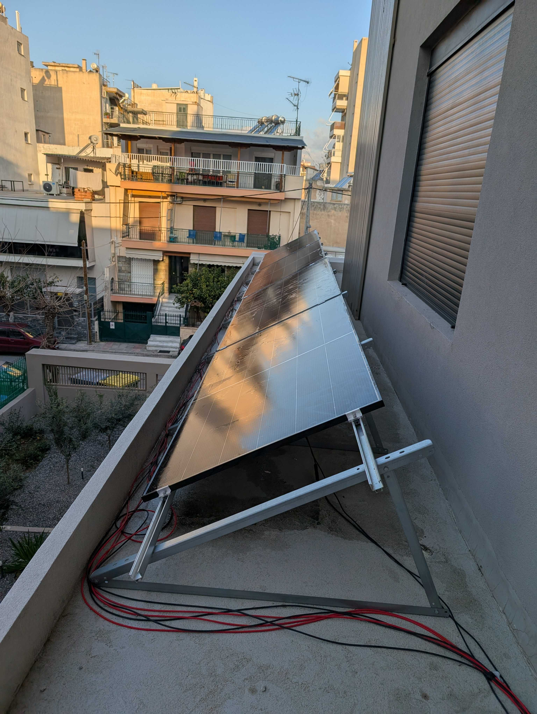
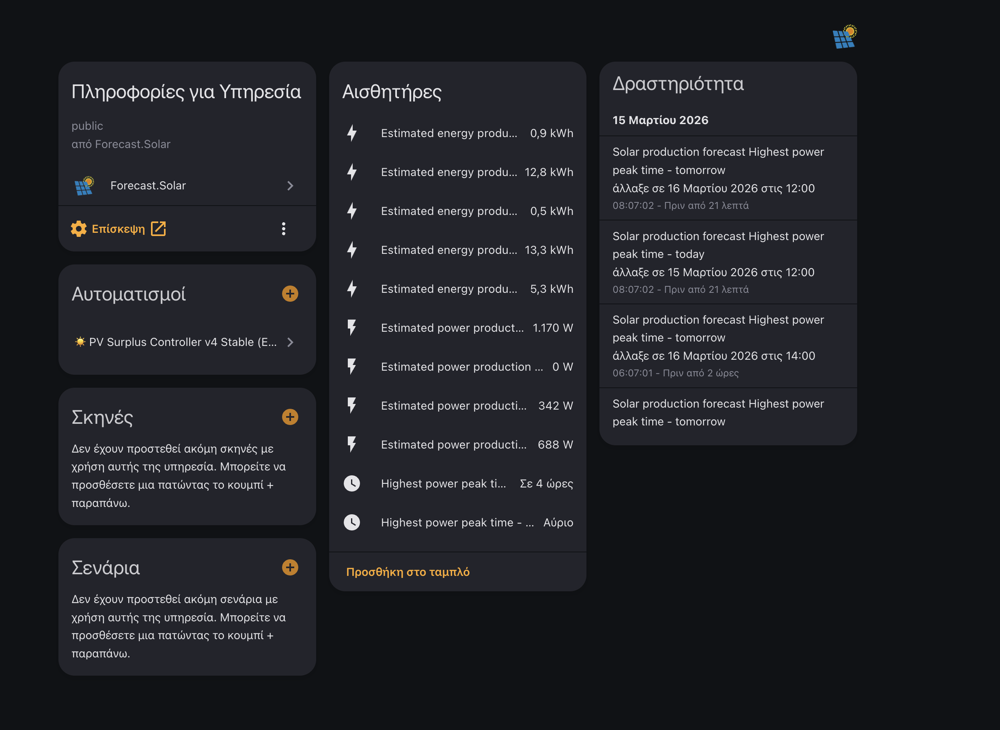
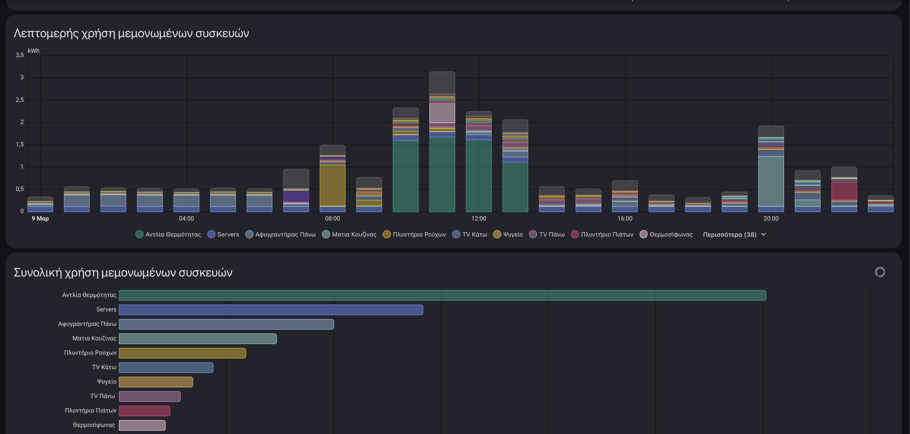

## The Bucket Analogy

Imagine your solar system as a water tap filling buckets.

The **sun tap** produces water (energy) during the day. You have a small **battery bucket** (3kWh usable) that fills up first. Then there's a **house bucket** that constantly leaks — lights, fridge, networking gear, about 300W dripping out all day. Occasionally someone turns on a **heavy faucet** — the dishwasher or washing machine — and 850W+ gushes out.

Then there's the **car bucket**. It's massive — an EV battery is like a swimming pool compared to your other buckets (the Tesla Model 3 Long Range has a 78 kWh battery — that's 25x the home battery). It can absorb energy for hours at a steady ~1.4kW at 6A.

The problem? Your tap has a **nozzle limit** — the inverter caps output at 1200W, and it can only aim at **one specific bucket** (phase C). Once the battery bucket overflows and there's no other bucket under the tap, the water just... spills on the floor. That's clipping. Energy produced but never used.

The controller I built is basically an **automated bucket manager**: it watches the tap pressure (PV), checks all bucket levels (battery SOC, forecast), and decides when to slide the car bucket under the tap — and when to pull it away so the battery bucket can fill up first.

## The Setup

| Component | Role |
|-----------|------|
| **[EcoFlow Stream Ultra](https://eu.ecoflow.com/products/stream-ultra-pro?variant=50510963016023)** | Inverter + 1.92kWh battery + 4 PV strings |
| **[EcoFlow AC Pro](https://eu.ecoflow.com/products/stream-ultra-pro?variant=50510963016023)** | Additional 1.92kWh battery |
| **[go-e charger](https://go-e.com/)** | EV charging control (force mode, phase switching, amp control) |
| **[Tesla](https://www.tesla.com/)** | The big bucket (EV) |
| **[EcoFlow 520W Bifacial Panels](https://eu.ecoflow.com/products/520w-rigid-solar-panel?variant=51572272202071)** | 4x 520W rigid bifacial solar panels |
| **[Shelly 3EM](https://www.shelly.com/en/products/shelly-3em)** | Per-phase current/power monitoring |
| **[Home Assistant](https://www.home-assistant.io/)** | The brain — runs the controller automation |



**Key constraints:**
- **Zero-export** — the inverter is configured to never feed energy back to the grid. This is common in setups without a grid-tie agreement or where regulations don't allow it. Every watt produced must be consumed or stored locally
- **3-phase house** — EcoFlow injects only on **phase C**
- **Inverter cap: 1200W** to the house side
- **Combined usable battery: 3.072kWh** (2×1.92kWh, 15%-95% window)

## What the Controller Actually Does

Every minute (plus on key state changes), the automation evaluates a decision tree:


flowchart TD
    A["Trigger — 1 min tick + events"] --> B["Evaluate all gates"]
    B --> C{Decision}
    C -->|"can_start AND not charging"| D["START car"]
    C -->|"must_stop AND charging"| E["STOP car"]
    C -->|"neither"| F["HYSTERESIS — keep current state"]
    D --> D1["Phase mode → single phase"]
    D --> D2["Charge mode → force charge"]
    D --> D3["Current → 6A"]
    E --> E1["Charge mode → don't charge"]
    E --> E2["Phase mode → 3-phase"]

    style D fill:#166534,stroke:#22c55e,color:#fff
    style E fill:#991b1b,stroke:#ef4444,color:#fff
    style F fill:#854d0e,stroke:#eab308,color:#fff


That third path — "neither" — is intentional **hysteresis**. The controller might not start a new session right now, but it also doesn't see a reason to kill an active one. This prevents oscillation between start/stop on borderline conditions.

### The Start Gate (`can_start`)

All of these must be true simultaneously:

```yaml
can_start:
  tesla_home                    # Car is at home
  and car_connected             # Plugged into charger
  and not heat_pump_on          # Heat pump not running
  and not heavy_home_device_on  # No dishwasher/washing >850W
  and soc_ok_for_start          # Battery SOC above dynamic threshold
  and reserve_ok                # Enough kWh in reserve
  and forecast_window_ok        # Solar forecast looks promising
  and phase_c_live_ok           # Phase C metrics confirm real surplus
```

The last two are the interesting ones. Note that `forecast_window_ok` also considers **actual PV production** — if the panels are producing >= 900W right now, the forecast gate passes regardless of what Forecast.Solar predicts. This was added after discovering that the forecast can significantly underestimate production on partly cloudy days (e.g., forecast showing 500W while panels produce 2kW).

### Forecast-Aware Dynamic Thresholds

The forecast data comes from **[Forecast.Solar](https://forecast.solar/)** — a free, public API that estimates solar production based on your panel location, orientation, and capacity. It integrates directly into Home Assistant via the built-in [Forecast.Solar integration](https://www.home-assistant.io/integrations/forecast_solar/), providing sensors for current estimated power, next-hour energy, and remaining production for the day.



The controller doesn't use fixed thresholds. Instead, it adjusts based on the **remaining solar forecast for today**:

| Remaining forecast | Start SOC | Reserve | Hard stop SOC |
|---|---|---|---|
| < 1.0 kWh (bad day) | 72% | 1.30 kWh | 67% |
| < 2.0 kWh | 69% | 1.10 kWh | 64% |
| < 3.0 kWh | 66% | 0.95 kWh | 61% |
| < 4.0 kWh | 64% | 0.80 kWh | 59% |
| < 5.5 kWh | 55% | 0.65 kWh | 50% |
| ≥ 5.5 kWh (strong day) | 48% | 0.50 kWh | 43% |

On a strong solar day, the controller is aggressive — it starts feeding the car early because there's plenty of sun left to refill the batteries. On a weak day, it hoards battery capacity and only feeds the car if the batteries are nearly full.

### The Phase C Live Gate

This is where the "bucket nozzle" problem gets real. EcoFlow injects **only on phase C**, so the controller uses EcoFlow's own phase-C metrics — not the 3-phase house totals:

```yaml
phase_c_live_ok:
  # Path 1: Strong PV, phase C not stressed, battery not draining
  (pv >= 900W and phase_c_grid <= 120W and battery_discharge <= 80W)
  or
  # Path 2: Very strong PV, battery actively charging, end-of-day target OK
  (pv >= 1200W and battery_charging >= 120W and battery_target_ok)
  or
  # Path 3: Forecast says sun is coming, current PV decent, phase C clean
  (forecast_next_hour >= 1100W and pv >= 700W
   and phase_c_grid <= 80W and battery_discharge <= 50W
   and battery_target_ok)
  or
  # Path 4: Battery full, EcoFlow throttling PV — forecast confirms sun
  (battery_soc >= 95% and forecast_now >= 900W and battery_discharge <= 200W)
```

Path 4 was added in v7 to handle a subtle EcoFlow behavior: when batteries hit 100%, the inverter throttles MPPT and reports 0W PV production — even though the panels are producing. Without this path, the controller would never start on a sunny afternoon with full batteries, which is exactly when you have the most surplus to give the car. The forecast acts as a sanity check that the sun is actually shining.

The `battery_target_ok` check is a policy gate: **will the batteries still reach ~95% by end of day if I divert surplus to the car now?** It compares the energy needed to fill the batteries against the remaining forecast with a buffer:

```
battery_kwh_needed = max(0, ((95 - current_soc) / 80) * 3.072)
battery_target_ok  = forecast_remaining >= (battery_kwh_needed + buffer)
```

The buffer ranges from 0.60 kWh on strong days to 1.00 kWh on weak days.

### The Stop Logic (`must_stop`)

Stop conditions are **contextual** — the controller doesn't panic on every fluctuation:

```yaml
must_stop:
  # Hard stops (unconditional)
  car_left or car_disconnected or soc_critically_low or reserve_depleted
  or heat_pump_on or heavy_device_on
  or grid_import_high_for_10min

  # Contextual stops (only in bad conditions + battery NOT charging)
  or (phase_c_grid_high_5min AND (battery_draining or low_pv or weak_forecast)
      AND battery_charging < 100W)
  or (battery_draining_5min AND phase_c_grid > 120W)
  or (battery_target_failing AND weak_forecast AND battery_not_charging)

  # Forecast-aware stop
  or (pv_low_10min AND weak_next_hour_forecast)
```

Phase C grid draw being high for 5 minutes isn't automatically a stop — only if it's **combined** with battery drain, low PV, or a weak forecast. The v7 addition `AND battery_charging < 100W` prevents a false stop that occurred in practice: during single-phase EV charging on phase C, the grid draw on that phase can be high simply because the charger load (~1.4kW) exceeds what EcoFlow can deliver on that single phase. But if the battery is still charging (e.g., 260W), that proves there's real surplus overall — the grid draw is just a per-phase distribution artifact. Without this guard, the controller would stop charging on a sunny afternoon when the system is clearly in surplus.

#### Hard Stops: Heat Pump and Heavy Loads

Two hard stops deserve special mention: the **heat pump** and **heavy home devices** (dishwasher, washing machine). These are unconditional — if either kicks in, the car stops immediately, no questions asked.

Why? The heat pump alone can draw 1.5-2.5kW, and a washing machine's heating cycle easily exceeds 850W. Combined with EV charging, that would overwhelm phase C and pull heavily from the grid — exactly what zero-export is supposed to prevent.

This works because we monitor almost every significant load in the house individually. The dashboard below shows a typical day — the heat pump (green) dominates, servers are the steady baseline, and the kitchen/washing machine create the big midday spikes. With this level of visibility, the controller knows *exactly* when to back off.



### Phase Switching — The Physical Puzzle

The go-e charger supports both 3-phase and single-phase charging, and can switch between them via software — known as **Phase Switch Mode** (psm) in go-e terminology. This turned out to be critical.

**Problem 1: 3-phase charging defeats the purpose.** When the charger runs 3-phase, it draws power across all three phases — roughly ~1.4kW per phase, ~4.4kW total at 6A. But EcoFlow only injects on phase C. So phases A and B pull straight from the grid. You think you're charging on surplus, but 2/3 of the power is coming from the grid anyway. The whole point of the controller is defeated.

The obvious fix: switch to single-phase charging during PV surplus, so the car only draws from the one phase that EcoFlow actually feeds.

**Problem 2: The go-e doesn't let you pick which phase.** When you force single-phase mode, the charger simply uses its **first connected phase** — whatever is wired as L1 in the charger. In my case, L1 was wired to **phase A** of the house. So even in single-phase mode, the car was drawing from the wrong phase — phase A instead of phase C where EcoFlow injects.

**The fix: call an electrician.** I had the electrician swap the phase A and phase C cables at the go-e charger. Now L1 (the go-e's "first phase") is physically connected to **phase C of the house** — the same phase where EcoFlow injects its 1200W.


After this rewiring:
- Single-phase charging at 6A draws ~1.4kW **on phase C**
- EcoFlow provides up to 1200W on that same phase
- Grid only needs to cover the ~200W difference
- The controller's phase-C metrics finally match physical reality

The go-e charger exposes three key controls via Home Assistant:

**Phase Switch Mode** (`psm`):

| Value | Name | Behavior |
|---|---|---|
| `0` | Auto | Charger decides phase count automatically |
| `1` | Force single phase | Always single-phase — draws from L1 only (phase C after rewiring) |
| `2` | Force three phase | Always three-phase — draws from all three phases |

**Charge Mode** (`frc`):

| Value | Name | Behavior |
|---|---|---|
| `0` | Neutral | Charger follows its internal logic mode (e.g., "Default" = charge immediately on plug-in) |
| `1` | Don't charge | Forces charger to stop/prevent charging |
| `2` | Charge | Forces charger to charge regardless of internal logic |

> **Warning:** The `frc` entity is a CONFIG-category API key in the [ha-goecharger-api2](https://github.com/marq24/ha-goecharger-api2) integration. In LAN polling mode, config values are only refreshed every **24 hours**. This means Home Assistant can show `frc=1` while the charger has internally reset to `frc=0` and is happily charging. See the [stale state section](#the-go-e-frc-stale-state-problem) below for the full story.

**Current** (`amp`): Charging amps (6A minimum for stable charging)

```yaml
# On PV surplus start:
Phase Switch Mode → "1"   # Force single phase (now = phase C after rewiring)
Charge Mode       → "2"   # Force charge
Current           → 6     # Minimum stable current

# On PV surplus stop:
Charge Mode       → "1"   # Don't charge
Phase Switch Mode → "2"   # Force 3-phase (restore for normal charging)
```

This was probably the most important physical change in the entire project. No amount of software logic can fix a phase mismatch.

### Enforcement Loops

Every tick, even while charging, the automation enforces:
- **Amps stay at 6A** — in case something changes them
- **Phase mode stays single-phase** — in case of drift
- **Tesla charge limit bumped to 90%** — if the car's SOC is near its current limit and there's surplus to absorb

## The go-e `frc` Stale State Problem

This one cost me days of debugging. The go-e charger's `frc` (force charge) state — the most critical control entity in this entire system — can be **stale in Home Assistant**.

The [ha-goecharger-api2](https://github.com/marq24/ha-goecharger-api2) integration classifies `frc` as a CONFIG-category API key. In polling mode (LAN, no WebSocket), config values are only refreshed every **24 hours**. Status values like `car` state and power readings are polled every cycle, but `frc` is not.

What this means in practice: you send `frc=1` (Don't charge) via Home Assistant. The charger receives it and stops. Hours later, the charger's internal logic resets `frc` back to `0` (Neutral). HA doesn't know — it still shows `frc=1`. Then the car gets plugged in. The charger, at `frc=0` with logic mode "Default", starts charging immediately at full power. Your automation checks: "is `frc` already 1? Yes. Nothing to do." Meanwhile the car is happily drawing 12kW from the grid.

The `modelStatus` entity tells the real story. When this happens, it shows `15 — Charging because of fallback (default)` — the charger is ignoring `frc=1` because it was never actually `1`.

**The fix:** never trust the cached `frc` state. Always re-send the command. The EV Plug-in Safety automation (below) sends `frc=1` twice with a 3-second gap on every plug-in event, regardless of what HA thinks the current state is.

Key entities for debugging:
- `sensor.goe_XXXXXX_car_value` — text car state (Idle/Charging/Wait for car/Complete) — STATUS category, polled every cycle
- `sensor.goe_XXXXXX_modelstatus_value` — exact reason for charging/not charging (41 possible states)
- `select.goe_XXXXXX_frc` — force state — **CONFIG category, polled every 24h only**

## EV Plug-in Safety Automation

The PV surplus controller decides *when* to charge. But there's a separate problem: the go-e charger with logic mode "Default" will **auto-start charging the moment a car is plugged in** — before any automation has a chance to react.

The safety automation's job: immediately set `frc=1` (Don't charge) on every plug-in event. The PV surplus controller can then decide to override with `frc=2` when conditions are right.

### Trigger Design

Getting this trigger right was harder than expected. Three approaches failed before finding one that works:

1. **`binary_sensor.goe_XXXXXX_car_0` with `to: "on"`** — the binary plug sensor. Failed because the trigger simply didn't fire on some plug-in events (unknown reason, possibly related to polling).

2. **`sensor.goe_XXXXXX_car_value` with `from: "Idle"`** — the text car state. Failed because the sensor goes `unavailable` between Idle and Charging during physical plug-in. So the actual transition is `unavailable → Charging`, not `Idle → Charging`, and the trigger doesn't match.

3. **`sensor.goe_XXXXXX_car_value` with `to: "Charging"` (no `from:`)** — this works but also fires when the PV surplus controller starts charging, causing a conflict.

The working solution uses multiple triggers with conditions to filter:

```yaml
triggers:
  - trigger: state
    entity_id: sensor.goe_XXXXXX_car_value
    to: "Charging"
  - trigger: state
    entity_id: sensor.goe_XXXXXX_car_value
    to: "Wait for car"
  - trigger: state
    entity_id: sensor.goe_XXXXXX_car_value
    to: "Complete"
  - trigger: state
    entity_id: device_tracker.my_tesla_location
    to: "home"

conditions:
  # Only act if PV surplus isn't actively managing (frc=2)
  - "{{ states('select.goe_XXXXXX_frc') != '2' }}"
  # Time window: only within 2 min of plug-in or 5 min of arriving home
  - "{{ car_0_age < 120 or tesla_home_age < 300 }}"
```

The `frc != '2'` condition prevents the safety automation from fighting the PV surplus controller. The time window prevents it from firing on car state changes that happen long after plug-in (e.g., phase switching bouncing the car state).

The Tesla location trigger catches the case where the charger sensor goes `unavailable` during plug-in and misses the transition entirely.

### Actions

Simple: send `frc=1` twice, 3 seconds apart. Never check the current state first (it might be stale).

```yaml
actions:
  - action: select.select_option
    target: { entity_id: select.goe_XXXXXX_frc }
    data: { option: "1" }
  - delay: "00:00:03"
  - action: select.select_option
    target: { entity_id: select.goe_XXXXXX_frc }
    data: { option: "1" }
```

## The Three-Automation Architecture

The system runs as three separate automations with clean separation of concerns:

| | PV Surplus Controller | EV Plug-in Safety | Load Guard |
|---|---|---|---|
| **Runs** | Every 1 min + events | On car state change / Tesla arriving home | Every 5 seconds |
| **Owns** | Phase mode, force mode, start/stop policy | Plug-in protection (frc=1 on connect) | Amp adjustment only |
| **Decides** | Should the car charge on surplus? | Should auto-charging be blocked? | Are the phases overloaded? |
| **Condition** | Always | Only when frc != 2 (not managed by surplus) | Only when frc is neutral (not forced) |

The **EV Plug-in Safety** automation was added in v7 to prevent auto-charging on plug-in. The go-e charger in "Default" logic mode starts charging immediately when a car connects — this automation fires first and blocks it. The PV surplus controller can then override when conditions are right.

The **Load Guard** is a fast current-throttling loop that protects against phase overload — it drops amps quickly and restores slowly. It runs independently and only when the PV surplus controller isn't in charge.

## The Zero-Export Takeaway

In a zero-export setup — where the inverter is configured to never push energy back to the grid — **having solar production doesn't mean it will be used 100%.** Unlike grid-tied systems where excess power earns you credits, here every watt must be consumed or stored in the moment. If there's no load to absorb it and the batteries are full or constrained by inverter limits, that energy is simply clipped — wasted.

Think of it this way: you have a tap that only runs during daylight, a small bucket (battery), and a nozzle that limits flow to 1200W. Once the bucket is full, you need a **big, steady, controllable drain** — or the tap just overflows.

The EV is the perfect drain. A heat pump works too. A boiler, maybe. But washing machines and random loads throughout the day? You're chasing surplus with a mop.

**My honest take: I wouldn't recommend a zero-export PV system to someone who doesn't have an EV or similarly large, controllable loads.** Without them, you end up throwing away a significant chunk of production, and the system loses much of its value. You *can* compensate by adding more battery capacity to absorb the surplus — but that makes the whole investment significantly more expensive and pushes the ROI further out. An EV or heat pump gives you a massive, free "battery" that's already there.

---

*If you have a similar setup or are thinking about building one, happy to share more details — I went through a lot of debugging to get here.* 😄

🌳 **Fun fact:** This blog is self-hosted on a local server — powered by the very same EcoFlow solar system described above. If you're reading this between 09:00 and 24:00 Greek time, the electrons serving this page were likely harvested from the sun earlier today.

## Appendix: The Full Automations

The system consists of three automations, a manual stop script, and two helpers. All YAML below contains placeholder entity IDs — replace them with your own.

> **Note:** You will need to create two helpers before deploying:
> - `input_boolean.ev_pv_surplus_enabled` — master enable/disable switch
> - `input_datetime.ev_pv_last_stop` — tracks when the last stop happened (for restart cooldown)

### Helpers

```yaml
input_boolean:
  ev_pv_surplus_enabled:
    name: EV PV Surplus Enabled
    icon: mdi:car-electric

input_datetime:
  ev_pv_last_stop:
    name: EV PV Last Stop
    has_date: true
    has_time: true
```

### Automation 1: PV Surplus Controller v7

This is the main brain — evaluates every minute whether to start or stop EV charging, manages phase switching, enforces restart cooldown after stop, and sends Telegram notifications.

<details>
<summary>Click to expand full YAML — PV Surplus Controller v7</summary>

```yaml
alias: "PV Surplus Controller v7 (EcoFlow phase-C + fixed 1ph surplus / fixed 3ph non-surplus)"
description: >-
  Stable PV surplus EV charging controller using EcoFlow phase-C metrics.
  PV surplus mode always uses fixed single-phase. Non-surplus / idle plugged-in
  mode always uses fixed three-phase. Trusts actual PV production alongside
  forecast. Battery charging guard prevents false stops. Adds bounded stop
  retry logic, restart cooldown after stop, and a master enable boolean for
  manual override.

triggers:
  - id: ha_start
    trigger: homeassistant
    event: start
  - id: tick
    trigger: time_pattern
    minutes: /1
  - id: pv_low_10m
    trigger: numeric_state
    entity_id: sensor.ecoflow_device_power_pv_sum
    below: 250
    for: "00:10:00"
  - id: grid_import_high_10m
    trigger: numeric_state
    entity_id: sensor.grid_import_total
    above: 1100
    for: "00:10:00"
  - id: phase_c_grid_high_5m
    trigger: numeric_state
    entity_id: sensor.ecoflow_device_power_sys_load_from_grid
    above: 180
    for: "00:05:00"
  - id: battery_discharging_5m
    trigger: numeric_state
    entity_id: sensor.ecoflow_device_power_battery
    below: -120
    for: "00:05:00"
  - id: tesla_home_changed
    trigger: state
    entity_id: device_tracker.my_tesla_location
  - id: car_connection_changed
    trigger: state
    entity_id: binary_sensor.goe_XXXXXX_car_0
  - id: heat_pump_changed
    trigger: state
    entity_id:
      - binary_sensor.heat_pump_pump_status
      - binary_sensor.heat_pump_compressor_status
  - id: dishwasher_above
    trigger: numeric_state
    entity_id: sensor.dishwasher_plug_power
    above: 850
  - id: dishwasher_below
    trigger: numeric_state
    entity_id: sensor.dishwasher_plug_power
    below: 850
  - id: washing_machine_above
    trigger: numeric_state
    entity_id: sensor.washing_machine_plug_power
    above: 850
  - id: washing_machine_below
    trigger: numeric_state
    entity_id: sensor.washing_machine_plug_power
    below: 850
  - id: forecast_changed
    trigger: state
    entity_id:
      - sensor.power_production_now_2
      - sensor.power_production_next_hour_2
      - sensor.energy_current_hour_2
      - sensor.energy_next_hour_2
      - sensor.energy_production_today_remaining_2
  - id: enable_changed
    trigger: state
    entity_id: input_boolean.ev_pv_surplus_enabled

conditions: []

actions:
  # --- Main decision: START or STOP ---
  - choose:
      - conditions:
          - condition: template
            value_template: "{{ can_start and not currently_charging }}"
        sequence:
          # Bump Tesla limit if needed
          - choose:
              - conditions:
                  - condition: template
                    value_template: "{{ blocked_by_limit and tesla_limit < target_tesla_limit }}"
                sequence:
                  - action: number.set_value
                    target:
                      entity_id: number.my_tesla_charge_limit
                    data:
                      value: "{{ target_tesla_limit }}"
          # Switch to single-phase
          - choose:
              - conditions:
                  - condition: template
                    value_template: "{{ psm_current != psm_single_phase }}"
                sequence:
                  - action: select.select_option
                    target:
                      entity_id: select.goe_XXXXXX_psm
                    data:
                      option: "{{ psm_single_phase }}"
                  - wait_template: "{{ is_state('select.goe_XXXXXX_psm', psm_single_phase) }}"
                    timeout: "00:00:08"
                    continue_on_timeout: true
          # Force charge mode
          - action: select.select_option
            target:
              entity_id: select.goe_XXXXXX_frc
            data:
              option: "2"
          - wait_template: "{{ is_state('select.goe_XXXXXX_frc', '2') }}"
            timeout: "00:00:05"
            continue_on_timeout: true
          # Set amps and notify
          - choose:
              - conditions:
                  - condition: state
                    entity_id: select.goe_XXXXXX_frc
                    state: "2"
                sequence:
                  - action: number.set_value
                    target:
                      entity_id: number.goe_XXXXXX_amp
                    data:
                      value: 6
                  - action: notify.send_message
                    target:
                      entity_id: notify.your_telegram_bot
                    data:
                      title: "PV Surplus: START"
                      message: >-
                        go-e Force -> 2 (PV mode, 6A) ·
                        Phase mode target {{ psm_single_phase }} (single-phase) ·
                        PV {{ (pv_w / 1000) | round(2) }}kW ·
                        Phase-C grid {{ phase_c_grid_w | round(0) }}W ·
                        EcoFlow SOC {{ eco_soc | round(1) }}%

      - conditions:
          - condition: template
            value_template: "{{ currently_charging and must_stop }}"
        sequence:
          # Stop with retry logic (up to 3 attempts)
          - repeat:
              count: 3
              sequence:
                - action: select.select_option
                  target:
                    entity_id: select.goe_XXXXXX_frc
                  data:
                    option: "1"
                - wait_template: >-
                    {{ is_state('select.goe_XXXXXX_frc', '1')
                       and (states('sensor.goe_XXXXXX_nrg_11') | float(0) < stop_power_threshold_w) }}
                  timeout: "00:00:08"
                  continue_on_timeout: true
          # Arm restart cooldown
          - action: input_datetime.set_datetime
            target:
              entity_id: input_datetime.ev_pv_last_stop
            data:
              datetime: "{{ now().strftime('%Y-%m-%d %H:%M:%S') }}"
          # Restore phase mode to Auto
          - choose:
              - conditions:
                  - condition: template
                    value_template: "{{ psm_current != psm_non_surplus }}"
                sequence:
                  - action: select.select_option
                    target:
                      entity_id: select.goe_XXXXXX_psm
                    data:
                      option: "{{ psm_non_surplus }}"
                  - wait_template: "{{ is_state('select.goe_XXXXXX_psm', psm_non_surplus) }}"
                    timeout: "00:00:08"
                    continue_on_timeout: true
          - action: notify.send_message
            target:
              entity_id: notify.your_telegram_bot
            data:
              title: "PV Surplus: STOP"
              message: >-
                go-e Force -> 1 (stop retry applied) ·
                Phase mode -> {{ psm_non_surplus }} (3-phase) ·
                Cooldown: {{ cooldown_minutes }} min ·
                Reason: {{ stop_reason | trim }} ·
                EcoFlow SOC {{ eco_soc | round(1) }}%

  # --- Enforcement: keep amps at 6A ---
  - choose:
      - conditions:
          - condition: state
            entity_id: select.goe_XXXXXX_frc
            state: "2"
          - condition: state
            entity_id: binary_sensor.goe_XXXXXX_car_0
            state: "on"
          - condition: template
            value_template: "{{ can_start }}"
          - condition: template
            value_template: "{{ states('number.goe_XXXXXX_amp') | int(0) != 6 }}"
        sequence:
          - action: number.set_value
            target:
              entity_id: number.goe_XXXXXX_amp
            data:
              value: 6

  # --- Enforcement: keep single-phase during charging ---
  - choose:
      - conditions:
          - condition: state
            entity_id: select.goe_XXXXXX_frc
            state: "2"
          - condition: state
            entity_id: binary_sensor.goe_XXXXXX_car_0
            state: "on"
          - condition: template
            value_template: "{{ can_start and psm_current != psm_single_phase }}"
        sequence:
          - action: select.select_option
            target:
              entity_id: select.goe_XXXXXX_psm
            data:
              option: "{{ psm_single_phase }}"

  # --- Enforcement: Tesla limit bump ---
  - choose:
      - conditions:
          - condition: state
            entity_id: select.goe_XXXXXX_frc
            state: "2"
          - condition: state
            entity_id: binary_sensor.goe_XXXXXX_car_0
            state: "on"
          - condition: template
            value_template: "{{ can_start and blocked_by_limit and tesla_limit < target_tesla_limit }}"
        sequence:
          - action: number.set_value
            target:
              entity_id: number.my_tesla_charge_limit
            data:
              value: "{{ target_tesla_limit }}"
          - action: notify.send_message
            target:
              entity_id: notify.your_telegram_bot
            data:
              title: "Tesla limit bumped"
              message: >-
                Tesla charge limit raised to {{ target_tesla_limit }}% ·
                Tesla SOC {{ tesla_soc | round(0) }}% ·
                PV {{ (pv_w / 1000) | round(2) }}kW

  # --- Fallback: restore phase mode when not in surplus ---
  - choose:
      - conditions:
          - condition: template
            value_template: >-
              {{ (not can_start) and is_state('select.goe_XXXXXX_frc', '1') and
                 is_state('binary_sensor.goe_XXXXXX_car_0', 'on') and
                 psm_current != psm_non_surplus }}
        sequence:
          - action: select.select_option
            target:
              entity_id: select.goe_XXXXXX_psm
            data:
              option: "{{ psm_non_surplus }}"

variables:
  pv_enabled: "{{ is_state('input_boolean.ev_pv_surplus_enabled', 'on') }}"
  tesla_home: "{{ is_state('device_tracker.my_tesla_location', 'home') }}"
  car_connected: "{{ is_state('binary_sensor.goe_XXXXXX_car_0', 'on') }}"
  currently_charging: "{{ is_state('select.goe_XXXXXX_frc', '2') }}"
  psm_current: "{{ states('select.goe_XXXXXX_psm') }}"
  psm_single_phase: "1"
  psm_non_surplus: "2"        # Force 3-phase (not Auto) for non-surplus
  stop_power_threshold_w: 250
  cooldown_minutes: 5
  cooldown_seconds: "{{ cooldown_minutes * 60 }}"
  last_stop_ts: >-
    
    
      0
    
      {{ as_timestamp(s, 0) }}
    
  cooldown_active: >-
    {{ (last_stop_ts | float(0)) > 0
       and ((as_timestamp(now()) - (last_stop_ts | float(0))) < (cooldown_seconds | float(0))) }}
  pv_w: "{{ states('sensor.ecoflow_device_power_pv_sum') | float(0) }}"
  phase_c_grid_w: "{{ states('sensor.ecoflow_device_power_sys_load_from_grid') | float(0) }}"
  battery_power_w: "{{ states('sensor.ecoflow_device_power_battery') | float(0) }}"
  battery_charging_w: "{{ [battery_power_w, 0] | max }}"
  battery_discharging_w: "{{ [0 - battery_power_w, 0] | max }}"
  eco_soc: "{{ states('sensor.combined_battery_soc') | float(0) }}"
  battery_usable_from_15_to_95_kwh: 3.072
  battery_floor_soc: 15
  usable_soc_span: 80
  usable_soc_above_floor: "{{ [eco_soc - battery_floor_soc, 0] | max }}"
  battery_available_kwh: >-
    {{ ((usable_soc_above_floor / usable_soc_span) * battery_usable_from_15_to_95_kwh) | float(0) }}
  energy_remaining_today_kwh: "{{ states('sensor.energy_production_today_remaining_2') | float(0) }}"
  forecast_now_w: "{{ states('sensor.power_production_now_2') | float(0) }}"
  forecast_next_hour_w: "{{ states('sensor.power_production_next_hour_2') | float(0) }}"
  energy_this_hour_kwh: "{{ states('sensor.energy_current_hour_2') | float(0) }}"
  energy_next_hour_kwh: "{{ states('sensor.energy_next_hour_2') | float(0) }}"
  dynamic_start_soc: >-
    72
    69
    66
    64
    55
    48
  dynamic_reserve_kwh: >-
    1.30
    1.10
    0.95
    0.80
    0.65
    0.50
  hard_stop_soc: "{{ [dynamic_start_soc | float(0) - 5, 20] | max }}"
  soc_ok_for_start: "{{ eco_soc >= (dynamic_start_soc | float(0)) }}"
  reserve_ok: "{{ battery_available_kwh >= (dynamic_reserve_kwh | float(0)) }}"
  soc_low_now: "{{ eco_soc <= (hard_stop_soc | float(0)) }}"
  tesla_soc: "{{ states('sensor.my_tesla_battery_level') | float(0) }}"
  tesla_limit: "{{ states('number.my_tesla_charge_limit') | float(0) }}"
  target_tesla_limit: 90
  blocked_by_limit: "{{ tesla_soc >= (tesla_limit - 1) }}"
  heat_pump_on: >-
    {{ is_state('binary_sensor.heat_pump_pump_status', 'on')
       or is_state('binary_sensor.heat_pump_compressor_status', 'on') }}
  heavy_device_dishwasher_w: "{{ states('sensor.dishwasher_plug_power') | float(0) }}"
  heavy_device_washing_machine_w: "{{ states('sensor.washing_machine_plug_power') | float(0) }}"
  heavy_device_max_w: "{{ [heavy_device_dishwasher_w, heavy_device_washing_machine_w] | max }}"
  heavy_home_device_on: "{{ heavy_device_max_w >= 850 }}"
  strong_now_forecast: "{{ forecast_now_w >= 900 or energy_this_hour_kwh >= 0.80 or pv_w >= 900 }}"
  strong_next_hour_forecast: "{{ forecast_next_hour_w >= 1100 or energy_next_hour_kwh >= 1.00 }}"
  strong_day_remaining: "{{ energy_remaining_today_kwh >= 5.5 }}"
  forecast_window_ok: >-
    {{ strong_now_forecast or strong_next_hour_forecast or strong_day_remaining }}
  battery_kwh_needed_to_95: >-
    {{ [(((95 - eco_soc) / 80) * battery_usable_from_15_to_95_kwh), 0] | max }}
  battery_target_buffer_kwh: >-
    1.00
    0.80
    0.60
  battery_target_ok: >-
    {{ energy_remaining_today_kwh >=
       ((battery_kwh_needed_to_95 | float(0)) + (battery_target_buffer_kwh | float(0))) }}
  phase_c_live_ok: >-
    {{ ((pv_w >= 900) and (phase_c_grid_w <= 120) and (battery_discharging_w <= 80))
       or ((pv_w >= 1200) and (battery_charging_w >= 120) and battery_target_ok)
       or ((forecast_next_hour_w >= 1100) and (pv_w >= 700)
           and (phase_c_grid_w <= 80) and (battery_discharging_w <= 50)
           and battery_target_ok)
       or ((eco_soc >= 95) and (forecast_now_w >= 900)
           and (battery_discharging_w <= 200)) }}
  low_pv_triggered: "{{ trigger is defined and trigger.id == 'pv_low_10m' }}"
  high_grid_import_triggered: "{{ trigger is defined and trigger.id == 'grid_import_high_10m' }}"
  phase_c_grid_high_triggered: "{{ trigger is defined and trigger.id == 'phase_c_grid_high_5m' }}"
  battery_discharging_triggered: "{{ trigger is defined and trigger.id == 'battery_discharging_5m' }}"
  can_start: >-
    {{ pv_enabled and tesla_home and car_connected and not heat_pump_on
       and not heavy_home_device_on and soc_ok_for_start and reserve_ok
       and forecast_window_ok and phase_c_live_ok and not cooldown_active }}
  must_stop: >-
    {{ (not pv_enabled) or (not tesla_home) or (not car_connected)
       or soc_low_now or (battery_available_kwh < 0.55)
       or heat_pump_on or heavy_home_device_on
       or high_grid_import_triggered
       or (phase_c_grid_high_triggered
           and ((battery_discharging_w > 80) or (pv_w < 900) or (not strong_next_hour_forecast))
           and (battery_charging_w < 100))
       or (battery_discharging_triggered and (phase_c_grid_w > 120))
       or ((not battery_target_ok) and (not strong_next_hour_forecast) and (battery_charging_w < 150))
       or (low_pv_triggered and not strong_next_hour_forecast) }}
  stop_reason: >-
    Manual disable / master switch off
    Heat pump active
    Tesla away
    Car disconnected
    EcoFlow SOC low ({{ eco_soc | round(1) }}%)
    EcoFlow reserve too low
    Phase-C grid draw high in bad conditions
    Battery discharging while phase-C grid used
    Total grid import high for 10m
    PV low + weak forecast
    Conditions not met

mode: restart
max_exceeded: silent
```

</details>

### Automation 2: EV Plug-in Safety

Prevents auto-charging on plug-in. Fires on car state change or Tesla arriving home. Skips if PV surplus is actively managing (frc=2). Always re-sends `frc=1` twice — never trusts cached state.

<details>
<summary>Click to expand full YAML — EV Plug-in Safety</summary>

```yaml
alias: "EV Plug-in Safety (always re-send Don't charge at home)"
description: >-
  Fires on charger state change or Tesla arriving home. Time-window prevents PV
  conflict. Skips if frc=2 (PV Surplus active).

triggers:
  - trigger: state
    entity_id: sensor.goe_XXXXXX_car_value
    to: "Charging"
    id: charging
  - trigger: state
    entity_id: sensor.goe_XXXXXX_car_value
    to: "Wait for car"
    id: wait_for_car
  - trigger: state
    entity_id: sensor.goe_XXXXXX_car_value
    to: "Complete"
    id: complete
  - trigger: state
    entity_id: device_tracker.my_tesla_location
    to: "home"
    id: tesla_arrived_home

conditions:
  - condition: state
    entity_id: device_tracker.my_tesla_location
    state: "home"
  - condition: state
    entity_id: binary_sensor.goe_XXXXXX_car_0
    state: "on"
  - condition: template
    value_template: >
      {{ states('sensor.goe_XXXXXX_car_value') in ['Charging', 'Wait for car', 'Complete'] }}
  - condition: template
    value_template: >
      {{ states('select.goe_XXXXXX_frc') != '2' }}
  - condition: template
    value_template: |
      {{
        (as_timestamp(now()) - as_timestamp(states.binary_sensor.goe_XXXXXX_car_0.last_changed)) < 120
        or (as_timestamp(now()) - as_timestamp(states.device_tracker.my_tesla_location.last_changed)) < 300
      }}

actions:
  - action: select.select_option
    target:
      entity_id: select.goe_XXXXXX_frc
    data:
      option: "1"
  - delay: "00:00:03"
  - action: select.select_option
    target:
      entity_id: select.goe_XXXXXX_frc
    data:
      option: "1"
  - action: notify.send_message
    target:
      entity_id: notify.your_telegram_bot
    data:
      title: "EV Plug-in Safety"
      message: >-
        Plug-in detected -> frc sent to Don't charge (twice).
        trigger={{ trigger.id }},
        car={{ states('sensor.goe_XXXXXX_car_value') }},
        frc={{ states('select.goe_XXXXXX_frc') }}.

mode: restart
```

</details>

### Automation 3: Load Guard

A fast 5-second loop that protects against phase overload. It only runs when the PV surplus controller is **not** active (frc != 1 and frc != 2). Drops amps quickly on overload, restores slowly when safe.

<details>
<summary>Click to expand full YAML — Load Guard</summary>

```yaml
alias: "EV Load Guard + Restore (go-e, fast local loop, quiet notify)"
description: >-
  Fast local loop for go-e. Drops current fast when phases rise, restores
  slowly. Telegram notifications are throttled: notify only on the first big event.

triggers:
  - seconds: /5
    trigger: time_pattern

conditions:
  - condition: state
    entity_id: binary_sensor.goe_XXXXXX_car_0
    state: "on"
  - condition: template
    value_template: "{{ states('select.goe_XXXXXX_frc') != '1' }}"
  - condition: template
    value_template: "{{ states('select.goe_XXXXXX_frc') != '2' }}"

actions:
  - variables:
      # --- Phase limits (amps) ---
      limit_a: 32
      limit_b: 32
      limit_c: 32
      margin_a: 2
      margin_b: 2
      margin_c: 2
      util_down: 0.95
      util_up: 0.85
      reduce_hyst_a: 0.3
      restore_hyst_a: 0.8
      step_up: 1
      cooldown_down_sec: 6
      cooldown_up_sec_active: 45
      cooldown_up_sec_idle: 900
      # --- Live measurements ---
      a: "{{ states('sensor.shellypro3em_XXXXXXXXXXXX_phase_a_current') | float(0) }}"
      b: "{{ states('sensor.shellypro3em_XXXXXXXXXXXX_phase_b_current') | float(0) }}"
      c: "{{ states('sensor.shellypro3em_XXXXXXXXXXXX_phase_c_current') | float(0) }}"
      maxI: "{{ [a, b, c] | max }}"
      charging_w: "{{ states('sensor.goe_XXXXXX_nrg_11') | float(0) }}"
      charging_active: "{{ charging_w > 300 }}"
      car_entity: number.goe_XXXXXX_amp
      cur: "{{ states(car_entity) | int(0) }}"
      amp_min: "{{ states('number.goe_XXXXXX_mca') | int(6) }}"
      last_change_ts: "{{ as_timestamp(states[car_entity].last_changed) }}"
      age_sec: "{{ as_timestamp(now()) - last_change_ts }}"
      cooldown_down_ok: "{{ age_sec > cooldown_down_sec }}"
      cooldown_up_ok: "{{ age_sec > (cooldown_up_sec_active if charging_active else cooldown_up_sec_idle) }}"
      amp_max: 16
      # --- Calculated thresholds ---
      hard_limit_max: "{{ [limit_a - margin_a, limit_b - margin_b, limit_c - margin_c] | max }}"
      safe_down_a: "{{ (limit_a - margin_a) * util_down }}"
      safe_down_b: "{{ (limit_b - margin_b) * util_down }}"
      safe_down_c: "{{ (limit_c - margin_c) * util_down }}"
      safe_down_max: "{{ [safe_down_a, safe_down_b, safe_down_c] | max }}"
      safe_up_a: "{{ (limit_a - margin_a) * util_up }}"
      safe_up_b: "{{ (limit_b - margin_b) * util_up }}"
      safe_up_c: "{{ (limit_c - margin_c) * util_up }}"
      safe_up_max: "{{ [safe_up_a, safe_up_b, safe_up_c] | max }}"
      other_a: "{{ max(0, a - cur) }}"
      other_b: "{{ max(0, b - cur) }}"
      other_c: "{{ max(0, c - cur) }}"
      allow_down_a: "{{ safe_down_a - other_a }}"
      allow_down_b: "{{ safe_down_b - other_b }}"
      allow_down_c: "{{ safe_down_c - other_c }}"
      allow_down_min: "{{ [allow_down_a, allow_down_b, allow_down_c] | min }}"
      target_down_raw: "{{ allow_down_min | round(0, 'floor') | int }}"
      target_down_clamped: "{{ [amp_min, [target_down_raw, amp_max] | min] | max }}"
      overload: "{{ maxI - (hard_limit_max - 0.2) }}"
      step_down_dyn: >-
        108
        642
      target_down_final: "{{ max(cur - step_down_dyn, target_down_clamped) }}"
      allow_up_a: "{{ safe_up_a - other_a }}"
      allow_up_b: "{{ safe_up_b - other_b }}"
      allow_up_c: "{{ safe_up_c - other_c }}"
      allow_up_min: "{{ [allow_up_a, allow_up_b, allow_up_c] | min }}"
      allow_up_ev: "{{ allow_up_min | round(0, 'floor') | int }}"
      target_up_candidate: "{{ cur + step_up }}"
      target_up_limited: "{{ [target_up_candidate, allow_up_ev, amp_max] | min }}"
      target_up_final: "{{ [amp_min, target_up_limited] | max }}"
      # --- Decisions ---
      should_reduce: >-
        {{ charging_active and (maxI > (safe_down_max + reduce_hyst_a))
           and (target_down_final < cur) and cooldown_down_ok }}
      should_restore: >-
        {{ charging_active and (maxI < (safe_up_max - restore_hyst_a))
           and (target_up_final > cur) and cooldown_up_ok }}
      drop_amt: "{{ (cur - target_down_final) | int(0) }}"
      near_hard_limit: "{{ maxI >= (hard_limit_max - 0.2) }}"
      notify_reduce: >-
        {{ (cur > amp_max and near_hard_limit)
           or (cur == amp_max and drop_amt >= 6 and near_hard_limit) }}

  - choose:
      # --- Reduce ---
      - conditions:
          - condition: template
            value_template: "{{ should_reduce }}"
        sequence:
          - condition: template
            value_template: "{{ target_down_final != cur }}"
          - action: number.set_value
            target:
              entity_id: number.goe_XXXXXX_amp
            data:
              value: "{{ target_down_final }}"
          - choose:
              - conditions:
                  - condition: template
                    value_template: "{{ notify_reduce }}"
                sequence:
                  - action: notify.send_message
                    target:
                      entity_id: notify.your_telegram_bot
                    data:
                      title: "EV Load Guard (go-e)"
                      message: >-
                        max={{ maxI | round(1) }}A
                        (hard={{ hard_limit_max | round(0) }}A)
                        go-e {{ cur }}->{{ target_down_final }}A
      # --- Restore ---
      - conditions:
          - condition: template
            value_template: "{{ (not should_reduce) and should_restore }}"
        sequence:
          - condition: template
            value_template: "{{ target_up_final != cur }}"
          - action: number.set_value
            target:
              entity_id: number.goe_XXXXXX_amp
            data:
              value: "{{ target_up_final }}"
          - choose:
              - conditions:
                  - condition: template
                    value_template: "{{ charging_active and (target_up_final == amp_max) }}"
                sequence:
                  - action: notify.send_message
                    target:
                      entity_id: notify.your_telegram_bot
                    data:
                      title: "EV Charging"
                      message: "Restored to max {{ amp_max }}A"

mode: restart
max_exceeded: silent
```

</details>

### Manual Stop Script

Use this script to manually stop PV surplus charging. It arms the restart cooldown so the controller won't immediately restart.

<details>
<summary>Click to expand full YAML — Manual Stop Script</summary>

```yaml
alias: EV PV Surplus Manual Stop
mode: single
sequence:
  - action: select.select_option
    target:
      entity_id: select.goe_XXXXXX_frc
    data:
      option: "1"
  - wait_template: "{{ is_state('select.goe_XXXXXX_frc', '1') }}"
    timeout: "00:00:08"
    continue_on_timeout: true
  - action: input_datetime.set_datetime
    target:
      entity_id: input_datetime.ev_pv_last_stop
    data:
      datetime: "{{ now().strftime('%Y-%m-%d %H:%M:%S') }}"
  - action: select.select_option
    target:
      entity_id: select.goe_XXXXXX_psm
    data:
      option: "2"
  - wait_template: "{{ is_state('select.goe_XXXXXX_psm', '2') }}"
    timeout: "00:00:08"
    continue_on_timeout: true
  - action: notify.send_message
    target:
      entity_id: notify.your_telegram_bot
    data:
      title: "PV Surplus: MANUAL STOP"
      message: >-
        Manual stop executed. go-e Force -> 1.
        Phase mode -> 2 (Force 3-phase).
        Restart cooldown armed (5 min).
```

</details>
