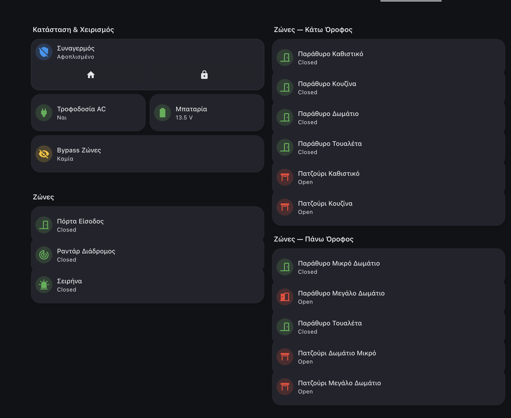

## A Closed Box on the Wall

I have a [Sigma](https://sigmasec.gr/) alarm system — a Greek brand you'll find in many residential installations here. It does its job well as an alarm: PIR sensors, door/window contacts, siren, keypad, the works. My panel has 15 zones covering every opening and room in the house.

The problem is that it's a completely closed ecosystem. No API. No MQTT. No webhooks. No documented way to talk to it from the outside.

The only remote access comes from an optional [Ixion IP module](https://sigmasec.gr/ixion-ip) — a small network addon that serves a basic HTML interface on port 5053. Through a browser, you can log in, see zone status, battery voltage, and AC power state. That's it. There are no arm/disarm buttons in the UI. No control at all from the web interface.

I wanted more. I wanted the alarm as a first-class entity in Home Assistant — arming on bedtime, disarming in the morning, zone sensors triggering lights, open-zone alerts on Telegram, battery and power monitoring. A proper integration.

Since Sigma wasn't going to give me an API, I built one.

## Step 1: Watching the Login with DevTools

The first step was opening Chrome DevTools and watching what happens when you log in through the browser.

The flow turned out to be more interesting than expected:

1. **GET `/login.html`** — the page contains a hidden input field called `gen_input` with a one-time token value
2. **JavaScript runs** — a function takes your password and the token, and produces an encrypted hex string
3. **POST `/login.html`** — the browser submits your username, the encrypted password, and the token length
4. **GET `/user.html`** — a second page asks for your PIN code
5. **POST `/ucode`** — the PIN is encrypted with the same algorithm using a fresh token from this page
6. **Session cookie** — after successful login, the panel issues a `SID` cookie for all subsequent requests

The interesting part was the encryption. It's not standard TLS or basic auth — the panel uses a **custom cipher built into its JavaScript** that runs client-side before submission.

## Step 2: Cracking the Cipher

Looking at the JavaScript source, the encryption turned out to be an **RC4-like stream cipher** with some obfuscation on top.

Here's what it does:

1. **Key scheduling** — initialize a 256-byte S-box using the one-time token as the key (classic RC4 KSA)
2. **Password padding** — the actual password gets sandwiched between random-length fragments from the token, plus two digits encoding the padding layout
3. **Keystream XOR** — each character of the padded string is XOR'd against the RC4 keystream
4. **Hex encoding** — the result is converted to hex for transmission

The padding is clever — even if you submit the same password twice, the encrypted output is different every time because the prefix/suffix lengths are randomized. The server can reverse it because the last two digits encode how the padding was constructed.

Here's the Python port:

```python
def _encrypt(self, secret: str, token: str) -> Tuple[str, str]:
    # RC4 key scheduling with the one-time token
    S = list(range(256))
    j = 0
    for i in range(256):
        j = (j + S[i] + ord(token[i % len(token)])) % 256
        S[i], S[j] = S[j], S[i]

    # Pad the password with random token fragments
    num = random.randint(1, 7)
    prefix = token[1:1 + num]
    suffix_len = 14 - num - len(secret)
    suffix = token[num:num + suffix_len]
    newpass = prefix + secret + suffix + str(num) + str(len(secret))

    # RC4 keystream generation + XOR
    i = j = 0
    out = []
    for ch in newpass:
        i = (i + 1) % 256
        j = (j + S[i]) % 256
        S[i], S[j] = S[j], S[i]
        K = S[(S[i] + S[j]) % 256]
        out.append(chr(ord(ch) ^ K))

    cipher = "".join(out)
    return "".join(f"{ord(c):02x}" for c in cipher), str(len(cipher))
```

This same function is used for both the password and the PIN — each time with a fresh token from the respective page.

## Step 3: Discovering the Hidden Endpoints

After getting login working in Python, I could browse the panel's pages programmatically. But there was a problem: **the web UI has no buttons for arming or disarming**. It's read-only.

So I started guessing URLs. The panel's interface uses simple `.html` paths, so I tried the obvious ones:

- `/arm.html` → **200 OK** — arms the system!
- `/stay.html` → **200 OK** — arms in perimeter/stay mode!
- `/disarm.html` → **200 OK** — disarms!
- `/done.html` → **200 OK** — reveals a hidden settings menu!

These endpoints exist, they work, they execute the command immediately when hit by an authenticated session — they're just not linked from anywhere in the UI. Someone at Sigma built them and never exposed them.

## Step 4: Parsing Greek HTML

Zone data comes from `/zones.html` — a plain HTML table with zone names, open/closed status, bypass state, battery voltage, and AC power. All in Greek.

The alarm status is a string like `AΦOΠΛIΣMENO` (Disarmed) or `ΠEPIMETPIKH OΠΛIΣH` (Perimeter Armed). These look like Greek text, but they're actually a mix of **Greek and Latin Unicode characters** that happen to look identical. For example, in `AΦOΠΛIΣMENO`: the `A`, `O`, `I`, `M` are Latin characters (U+0041, U+004F, etc.), while `Φ`, `Π`, `Λ`, `Σ` are actual Greek (U+03A6, U+03A0, etc.). This is common in older Greek hardware firmware — developers used whichever character looked right visually, regardless of the actual Unicode codepoint. It means a simple string match for the Greek word "ΑΦΟΠΛΙΣΜΕΝΟ" would fail, because half the characters are secretly Latin. The parser handles both:

```python
# Alarm status
alarm_match = re.search(r"Τμήμα\s*\d+\s*:\s*(.+)", text)

# Battery voltage
battery_match = re.search(r"Μπαταρία:\s*([\d.]+)\s*Volt", text)

# AC power — handles Greek Unicode AND Latin transliteration
ac_match = re.search(r"Παροχή\s*230V:\s*(ΝΑΙ|NAI|OXI|Yes|No)", text)
```

Zone statuses come as `κλειστή` (Closed) and `ανοικτή` (Open), which get normalized to English for Home Assistant. Bypass state uses `ΝΑΙ`/`OXI` (Yes/No).

## Step 5: Making It Survive in Production

A proprietary web interface designed for occasional browser use does not appreciate being polled every 10 seconds. The panel is slow, the HTML sometimes comes back incomplete, sessions expire randomly, and — the best one — **the panel only supports one active session per user**. If Home Assistant is polling, the web UI kicks you out, and vice versa.

I built five layers of resilience:

### Layer 1: HTTP Retries
Standard `urllib3.Retry` with exponential backoff for 500/502/503/504 errors. The panel occasionally returns server errors under load.

### Layer 2: HTML Parse Retries
A decorator that catches `AttributeError`/`IndexError` (partial HTML responses) and retries with backoff:

```python
def retry_html_request(func):
    def wrapper(*args, **kwargs):
        for attempt in range(1, RETRY_ATTEMPTS_FOR_HTML + 1):
            try:
                return func(*args, **kwargs)
            except (AttributeError, IndexError, TypeError) as exc:
                logger.warning("HTML parse failed (%d/%d): %s",
                             attempt, RETRY_ATTEMPTS_FOR_HTML, exc)
                time.sleep(RETRY_BACKOFF_FACTOR * (2 ** (attempt - 1)))
        raise RuntimeError("HTML parsing failed after max attempts")
    return wrapper
```

### Layer 3: Session Reuse with Fallback
Before doing a full login on every poll, the client tries to reuse the existing session by going directly to the zones page. If the data comes back incomplete (session expired), it falls back to a full logout→login→navigate cycle. This optimizes for the common case where the session is still valid.

### Layer 4: Coordinator-Level Graceful Degradation
The HA coordinator maintains `_last_data` and a `_consecutive_failures` counter. If a fetch fails but we have recent data, we return the last-known-good data and log a warning. The entities only go `unavailable` after multiple consecutive failures. This prevents brief network hiccups from making every sensor flash.

### Layer 5: Action Retry with State Verification
Arm/disarm actions are the most critical. The flow uses up to 5 full attempts, each with its own authentication cycle:


flowchart TD
    A["Acquire async lock"] --> B["Check: already in desired state?"]
    B -->|Yes| C["Return success"]
    B -->|No| D["Select partition → Hit /arm.html"]
    D --> E["Poll 5x for state change"]
    E -->|Changed| F["Push data to coordinator → return success"]
    E -->|No change| G{"Attempts left?"}
    G -->|Yes| H["Re-authenticate → retry"]
    H --> D
    G -->|No| I["Return failure after 5 attempts"]

    style C fill:#166534,stroke:#22c55e,color:#fff
    style F fill:#166534,stroke:#22c55e,color:#fff
    style I fill:#991b1b,stroke:#ef4444,color:#fff


The async lock is critical — it prevents the polling coordinator from running while an action is in progress. Without it, two sessions would collide and the panel would reject both.

## What the Integration Exposes

| Entity | Type | Details |
|--------|------|---------|
| **Alarm Control Panel** | `alarm_control_panel` | Arm Away, Arm Home (perimeter), Disarm |
| **Alarm Status** | `sensor` | Current state as text |
| **Battery Voltage** | `sensor` | Volts (numeric, triggers alert below 12V) |
| **AC Power** | `sensor` | On/Off (triggers alert on power loss) |
| **Zone Status** (×15) | `sensor` | Open / Closed per zone |
| **Zone Bypass** (×15) | `sensor` | Bypassed or not per zone |

That's 34 entities from one integration.



The zone sensors are where it gets really interesting.

## What 15 Alarm Zones Can Do in Home Assistant

The alarm zones are wired to every door, window, and PIR sensor in the house. Once they're in HA as sensors, they become the backbone of automations that have nothing to do with security.

### Bedtime Detection — Phone Hits Wireless Charger

When my phone starts wireless charging between 21:00–03:00 and the alarm is disarmed: close the roller shutter and arm the alarm in perimeter mode. No bedtime routine to remember — just place the phone on the nightstand and the house locks itself.

### Morning Routine — Phone Unplugged

When the phone unplugs from AC between 06:00–12:00 **and** it's connected to a home WiFi BSSID (so it doesn't trigger at a hotel): disarm the alarm, turn on the espresso machine, wait 10 minutes, then open the roller shutter. The WiFi BSSID check is the key — it confirms you're physically home, not just unplugging a charger somewhere else.

### Leaving Home — Everything Off

When the alarm arms to away mode: turn off TV, receiver, espresso machine, and every light in the house. One action from the keypad on the way out, and the house goes dark.

### Open Zone Alert

When the alarm arms away, the automation checks all 15 zones. If any are open (you left a window), it sends a Telegram message listing exactly which ones:

```yaml
message: >-
  
  

  Alarm armed but these zones are open:
  {{ open_zones | join('\n• ', '• ') }}
```

### Window Opens → Balcony Light

The kitchen window (zone 03) opens after sunset → balcony light turns on. Window closes → light turns off. Same for living room, bedroom. No extra hardware — the alarm contacts are already on every opening.

### Welcome Home Lights

Front door zone opens while alarm is in any armed state → hallway and staircase lights turn on automatically.

### Battery & Power Alerts

Battery below 12V → Telegram. AC power lost → Telegram. Simple but critical — you want to know if the backup battery is dying or if power was cut.

### Vacuum Scheduling

The robot vacuum automation checks `alarm != armed_away` before starting — because the house has radar/PIR motion sensors tied to the alarm. If the vacuums run while we're away, the motion sensors detect them and trigger the alarm. So the vacuums only run when someone is home.

## The Project

The integration is open source, installable via HACS:

**[github.com/phoinixgrr/sigma_connect_ha](https://github.com/phoinixgrr/sigma_connect_ha)**

Tested with Ixion v1.3.9 on AEOLUS v12.0 and S-PRO 32 panels. If you have a Sigma alarm with an Ixion IP module, give it a try.

Built during Greek Easter 2025 — which is why there are red Easter eggs in the logo. 🥚🇬🇷

## The Takeaway

The alarm industry loves closed ecosystems. But if a device has a web interface, it has an integration surface. Browser DevTools, patience with JavaScript, and some resilience engineering is all it takes.

The biggest payoff wasn't the arm/disarm control — it was the **zones**. Fifteen sensors already wired into every door and window in the house, sitting unused by anything except the alarm. Now they're window sensors, door sensors, presence triggers, and lighting controllers. The alarm became the backbone of half my home automations, and all it took was an Easter weekend of reverse engineering.
