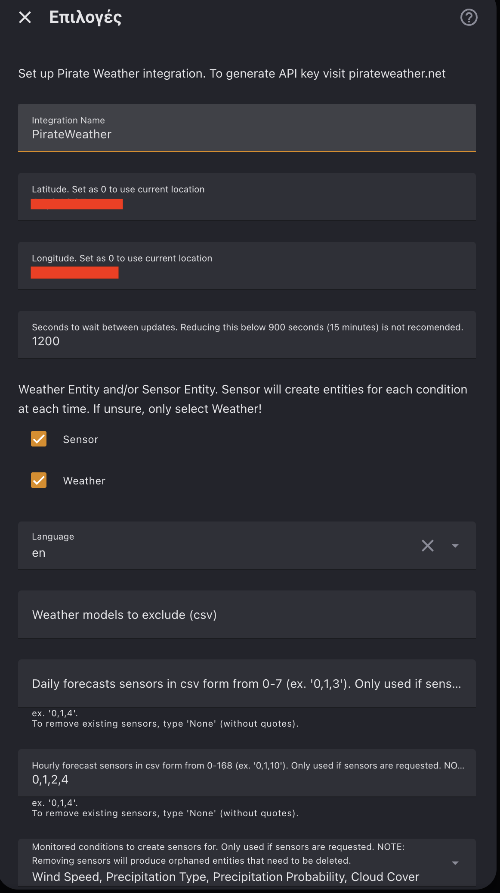
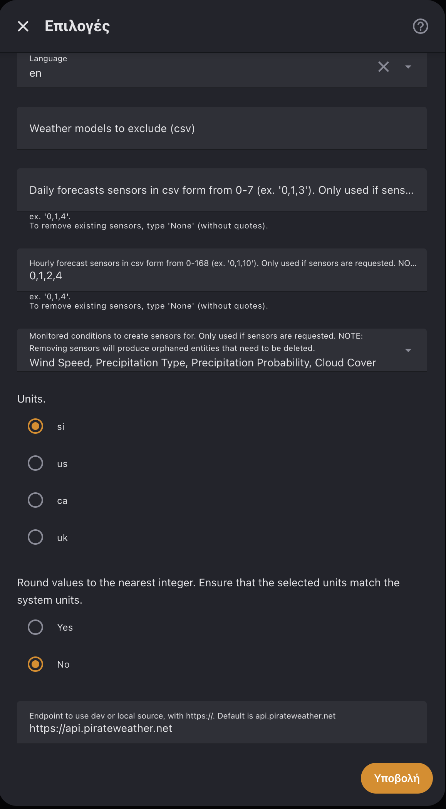

## The Problem

Retractable awnings are great — until a gust of wind catches them. A strong gust can bend the arms, rip the fabric, or tear the whole thing off the wall. Rain pools on the fabric, stretches it, and eventually the weight pulls everything down.


I have three motorized awnings controlled by [Shelly Plus 2PM](https://www.shelly.com/products/shelly-plus-2pm) relays — one front-facing, two on the sides. The old approach: manually check the weather, remember to retract, hope you don't forget. That's one destroyed awning waiting to happen.

## The Key Insight: Different Thresholds for Different Time Windows

The simplest approach — "if wind is above X, retract" — works, but it doesn't account for timing. A forecast showing 15 km/h wind in 4 hours shouldn't trigger the same response as 15 km/h right now.

The solution: **strict thresholds for the immediate forecast, progressively relaxed for further out.**

### Protection (Retract) — OR logic, any one triggers it

| Horizon | Wind above | Rain prob. above |
|---------|-----------|-----------------|
| **Now** | 12 km/h | 14% |
| **+1h** | 12 km/h | 19% |
| **+2h** | 14 km/h | 24% |
| **+4h** | 16 km/h | 29% |

### Deploy — AND logic, all must pass

| Horizon | Wind below | Rain prob. below |
|---------|-----------|-----------------|
| **Now** | 9 km/h | 11% |
| **+1h** | 13 km/h | 13% |
| **+2h** | 15 km/h | 15% |
| **+4h** | 17 km/h | 17% |

The asymmetry is intentional:
- **Retract is aggressive** — one bad signal at any horizon pulls them in. False positives cost nothing except shade.
- **Deploy is conservative** — every horizon must be clean. False positives cost a destroyed awning.
- The 3 km/h gap between retract (12) and deploy (9) creates **hysteresis** — no oscillation on borderline wind.

## The Weather Data

I use [PirateWeather](https://pirateweather.net/) — a free weather API available as a [HACS custom integration](https://github.com/alexander0042/pirate-weather-ha). The key feature is that during setup, you can select **which hourly forecast offsets** to create as sensors. I selected hours 0, 1, 2, and 4 — and the integration automatically creates individual sensors for each:

| Sensor | What it provides |
|--------|-----------------|
| `sensor.pirateweather_wind_speed` | Current wind speed |
| `sensor.pirateweather_wind_speed_1h` | Wind forecast +1 hour |
| `sensor.pirateweather_wind_speed_2h` | Wind forecast +2 hours |
| `sensor.pirateweather_wind_speed_4h` | Wind forecast +4 hours |
| `sensor.pirateweather_precip_probability_0h` | Current rain probability |
| `sensor.pirateweather_precip_probability_1h` | Rain probability +1 hour |
| `sensor.pirateweather_precip_probability_2h` | Rain probability +2 hours |
| `sensor.pirateweather_precip_probability_4h` | Rain probability +4 hours |

No template sensors needed — PirateWeather generates them natively. Here's how it looks in the configuration:





The key fields are **Hourly forecast sensors** set to `0,1,2,4` and **Monitored conditions** including Wind Speed and Precipitation Probability. Any weather integration that provides multi-hour forecasts would work with the same pattern.

### Hardware Alternative for Faster Reaction

Forecast APIs update on intervals and **cannot react to sudden gusts** in real-time. For more reactive protection, consider adding local hardware sensors:

- **Rain**: [Shelly Flood Gen4](https://us.shelly.com/products/shelly-flood-gen4) — detects water immediately, no forecast delay
- **Wind**: [Ecowitt WS90 7-in-1 Weather Station](https://www.shelly.com/products/ecowitt-ws90-7-in-1-weather-station) — solar-powered with anemometer, integrates via [Ecowitt](https://www.home-assistant.io/integrations/ecowitt/) into HA

A hardware rain sensor + the forecast-based wind protection would give you the best of both worlds: instant rain response and predictive wind retraction.

## How It Works

Both automations run **every minute**.

**Protection** checks if any awning is extended and if **any** weather horizon exceeds its threshold:

```yaml
   
   

{{ (wind_now > w0) or (wind_1h > w1) or (wind_2h > w2) or (wind_4h > w4)
   or (precip_0h > p0) or (precip_1h > p1) or (precip_2h > p2) or (precip_4h > p4) }}
```

**Deploy** only extends if sun is up, **all** horizons are below threshold, and the awnings have been retracted for a minimum time (6 hours front, 4 hours sides). The minimum time prevents toggling on unstable weather days.

Both send a Telegram notification on action.

## The Hardware

| Component | Role |
|-----------|------|
| **[Shelly Plus 2PM](https://www.shelly.com/products/shelly-plus-2pm)** (×3) | Motor control per awning |
| **[PirateWeather](https://pirateweather.net/)** | Free weather API with multi-horizon forecasts |
| **Home Assistant** | Evaluates weather, controls awnings, sends notifications |

## The Result

Zero weather-related awning incidents since deploying this. The system has correctly retracted before several storms I would have missed. On calm days, awnings deploy automatically — shade when you want it, protection when you need it.

The tiered forecast pattern is reusable for anything weather-sensitive: pool covers, irrigation, outdoor speakers, garden furniture. The principle: **strict for now, relaxed for later, asymmetric retract/deploy, hysteresis to prevent flapping.**

## Appendix: Full Automation YAML

<details>
<summary>Click to expand — Protection (Retract)</summary>

```yaml
alias: "Awning Protection — Retract on Wind/Rain"
triggers:
  - minutes: /1
    trigger: time_pattern

conditions:
  - condition: template
    value_template: >-
      {{ (state_attr('cover.awning_front', 'current_position')|int(100) < 100)
         or (state_attr('cover.awning_side_1', 'current_position')|int(100) < 100)
         or (state_attr('cover.awning_side_2', 'current_position')|int(100) < 100) }}

  - condition: template
    value_template: >-
         
         
      {{ (states('sensor.pirateweather_wind_speed')|float(0) > w0)
         or (states('sensor.pirateweather_wind_speed_1h')|float(0) > w1)
         or (states('sensor.pirateweather_wind_speed_2h')|float(0) > w2)
         or (states('sensor.pirateweather_wind_speed_4h')|float(0) > w4)
         or (states('sensor.pirateweather_precip_probability_0h')|float(0) > p0)
         or (states('sensor.pirateweather_precip_probability_1h')|float(0) > p1)
         or (states('sensor.pirateweather_precip_probability_2h')|float(0) > p2)
         or (states('sensor.pirateweather_precip_probability_4h')|float(0) > p4) }}

actions:
  - target:
      entity_id:
        - cover.awning_front
        - cover.awning_side_1
        - cover.awning_side_2
    action: cover.open_cover
  - action: notify.send_message
    target:
      entity_id: notify.your_telegram_bot
    data:
      title: "Awning Protection"
      message: "Wind or rain expected. Retracting awnings!"

mode: single
```

</details>

<details>
<summary>Click to expand — Deploy</summary>

```yaml
alias: "Awning Deploy — Extend on Calm Weather"
triggers:
  - minutes: /1
    trigger: time_pattern

conditions:
  - condition: or
    conditions:
      - condition: state
        entity_id: cover.awning_front
        state: open
      - condition: state
        entity_id: cover.awning_side_1
        state: open
      - condition: state
        entity_id: cover.awning_side_2
        state: open

  - condition: template
    value_template: >-
         
         
      {{ is_state('sun.sun', 'above_horizon')
         and (states('sensor.pirateweather_wind_speed')|float(999) < w0)
         and (states('sensor.pirateweather_wind_speed_1h')|float(999) < w1)
         and (states('sensor.pirateweather_wind_speed_2h')|float(999) < w2)
         and (states('sensor.pirateweather_wind_speed_4h')|float(999) < w4)
         and (states('sensor.pirateweather_precip_probability_0h')|float(999) < p0)
         and (states('sensor.pirateweather_precip_probability_1h')|float(999) < p1)
         and (states('sensor.pirateweather_precip_probability_2h')|float(999) < p2)
         and (states('sensor.pirateweather_precip_probability_4h')|float(999) < p4) }}

  - condition: or
    conditions:
      - condition: state
        entity_id: cover.awning_front
        state: open
        for:
          hours: 6
      - condition: and
        conditions:
          - condition: state
            entity_id: cover.awning_side_1
            state: open
            for:
              hours: 6
          - condition: state
            entity_id: cover.awning_side_2
            state: open
            for:
              hours: 4

actions:
  - target:
      entity_id:
        - cover.awning_front
        - cover.awning_side_1
        - cover.awning_side_2
    action: cover.close_cover
  - action: notify.send_message
    target:
      entity_id: notify.your_telegram_bot
    data:
      title: "Awning Deploy"
      message: "Weather is calm and sunny. Deploying awnings!"

mode: single
```

</details>
