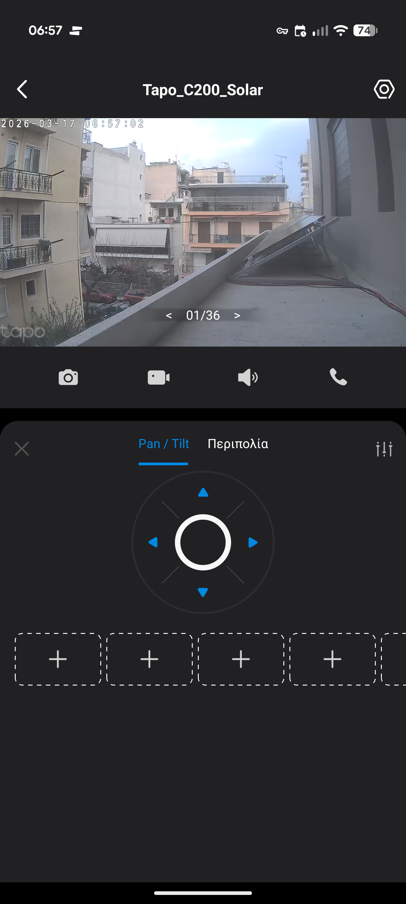
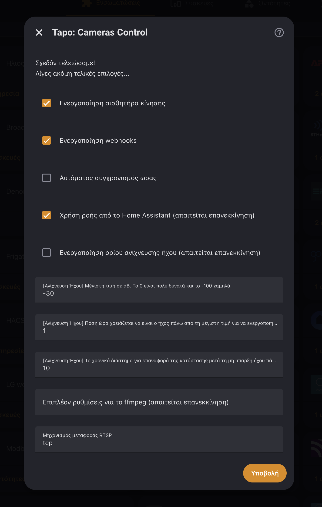

## The Problem

Three [Tapo C200](https://www.tp-link.com/gr/home-networking/cloud-camera/tapo-c200/) cameras feed into [Frigate](https://frigate.video/) for recording and person detection. The live feeds show up fine in Home Assistant, but the **PTZ controls — Pan, Tilt, Zoom — are trapped inside the Tapo app**. The C200 is a motorized camera that can physically rotate left/right (pan) and up/down (tilt), but the only way to control that was pulling out my phone.



Frigate consumes RTSP streams for recording and detection — it doesn't know or care about camera movement. I needed something to bridge the gap.

## The Solution

The [Tapo: Cameras Control](https://github.com/JurajNyiri/HomeAssistant-Tapo-Control) HACS integration connects to each camera's local API and exposes `button` entities for movement — `move_up`, `move_down`, `move_left`, `move_right`. The [Advanced Camera Card](https://github.com/dermotduffy/advanced-camera-card) can overlay PTZ controls on the live feed and call those buttons.

Frigate handles video. Tapo integration handles controls. They don't step on each other.

## Setup

### 1. Install & Configure

Install **Tapo: Cameras Control** from HACS, then add each camera under **Settings → Devices & Services**.

| Field | Value |
|-------|-------|
| IP Address | Camera's static IP |
| Port | `443` (default) |
| Camera credentials | Your camera account (set in Tapo app → Advanced Settings → Camera Account) |
| Cloud password | Your Tapo app login password |

Two gotchas:

- **Enable Third-Party Compatibility** first: Tapo App → Εγώ → Tapo Lab → Third-Party Compatibility → On
- **Check "Skip RTSP"** and uncheck **"Use stream from HA"** — Frigate already owns the streams



### 2. Find Entity IDs

**Developer Tools → States**, filter for `button.tapo`. Each camera gets four movement buttons:

```
button.tapo_c200_solar_move_up
button.tapo_c200_solar_move_down
button.tapo_c200_solar_move_left
button.tapo_c200_solar_move_right
```

The prefix varies per camera — some use the friendly name, others a MAC suffix.

### 3. Add PTZ to the Dashboard

The Advanced Camera Card needs PTZ configured in **two places**: actions under `cameras[].ptz` and visibility under `live.controls.ptz`. Miss the second and the controls exist but are invisible.

```yaml
type: custom:advanced-camera-card
cameras:
  - camera_entity: camera.eisodos
    ptz:
      actions_left:
        action: perform-action
        perform_action: button.press
        data:
          entity_id: button.tapo_c200_xxxx_move_left
      actions_right:
        action: perform-action
        perform_action: button.press
        data:
          entity_id: button.tapo_c200_xxxx_move_right
      actions_up:
        action: perform-action
        perform_action: button.press
        data:
          entity_id: button.tapo_c200_xxxx_move_up
      actions_down:
        action: perform-action
        perform_action: button.press
        data:
          entity_id: button.tapo_c200_xxxx_move_down
live:
  display:
    mode: grid
  controls:
    ptz:
      mode: "on"
      position: bottom-right
      hide_zoom: true
      hide_home: true
tap_action:
  action: fullscreen
dimensions:
  aspect_ratio_mode: dynamic
  aspect_ratio: "16:9"
  height: 250px
```

**`mode: "on"`** is critical — the default `auto` only shows controls for cameras that natively advertise PTZ, which Frigate entities don't.

## Bonus Entities

The integration exposes more than PTZ:

| Entity | Use |
|--------|-----|
| `switch.*_privacy` | Points camera down, stops recording — great for "I'm home" automations |
| `switch.*_auto_track` | Auto-follow moving objects |
| `switch.*_indicator_led` | Kill the status LED at night |
| `button.*_manual_alarm_start` | Trigger the camera's built-in siren |
